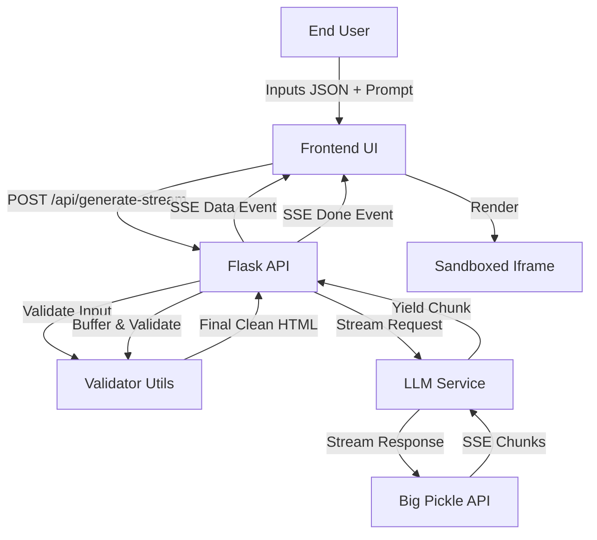

# Instant Dashboard — Technical Instruction Manual

> **Version:** 1.1.0
> **Last Updated:** 2026-02-12
> **Audience:** Developers, Auditors, Systems Architects

---

## SECTION A – Full System Architecture

### High-Level Architecture
Instant Dashboard uses a **Serverless-First** approach built on Python/Flask and deployed to Vercel. This stateless architecture ensures scalability and reduces operational overhead.

The core flow is:
1.  **Client-Side Capture:** User inputs raw JSON data and styling prompts.
2.  **API Gateway:** Flask routes handle input validation.
3.  **Service Layer:** The backend orchestrates a call to the **Big Pickle** LLM using streaming for optimal time-to-first-byte.
4.  **Streaming Pipeline:** The backend streams chunks to the client via Server-Sent Events (SSE) while simultaneously buffering them for validation.
5.  **Sanitisation:** The final buffered HTML is strictly sanitised to strip executable code.
6.  **Presentation Layer:** The sanitised HTML is rendered inside a restrictive `sandbox` iframe to prevent XSS.

### Component Interaction Map

---

## SECTION B – Frontend Technical Breakdown

### Component List
- **`landing.html`**: Marketing page with CSS grid animations (`.bg-grid`).
- **`generate.html`**: The main application interface. Splits screen into sidebar (input) and main area (preview).
- **`json-input`**: A `textarea` specifically styled for code input (`font-family: monospace`).
- **`preview-iframe`**: Utilizing the `srcdoc` attribute to render HTML content without a round-trip.
- **`live-code-view`**: A scrolling value that displays the raw HTML as it packages in real-time.

### State Management
The frontend relies on **DOM-based state management** via `generator.js`.
- **`generatedHTML`**: A global variable stores the validated HTML payload for the "Download" functionality.
- **UI States**: `idle`, `streaming`, `complete` (iframe visible), `error`.

### Form Validation Logic
Client-side validation occurs before any network request:
1.  **JSON Format**: `JSON.parse()` is attempted in a `try/catch` block.
2.  **Prompt Length**: Enforced via `maxlength` (500 chars).
3.  **Empty Fields**: Both JSON and Prompt are required.

---

## SECTION C – Backend Technical Breakdown

### Route Listing
| Route | Method | Description |
|-------|--------|-------------|
| `/` | GET | Serves the landing page. |
| `/generate` | GET | Serves the generator tool UI. |
| `/api/generate` | POST | Legacy non-streaming endpoint. |
| `/api/generate-stream` | POST | Primary SSE streaming endpoint. |

### API Request Lifecycle (Streaming)
1.  **Payload Parsing**: Flask parses JSON body.
2.  **Validation**:
    - `validate_json_input`: Re-verifies JSON parseability.
    - `validate_prompt`: Checks length constraints.
3.  **LLM Integration**:
    - Constructs system prompt + user JSON.
    - Calls `services.llm_service.stream_llm`.
4.  **Streaming Response**:
    - Yields `data: {"chunk": "..."}` events for each token.
    - Accumulates full content in memory.
5.  **Finalisation**:
    - Once stream ends, passes full content to `validate_html_output`.
    - If valid, yields `event: done` with the sanitised HTML.
    - If invalid, yields `event: error`.

---

## SECTION D – Database Documentation

### Architecture
This application is **Stateless**. No user data is persisted.

- **Data Persistence**: None. All data is transient in memory.
- **Session Storage**: None.

---

## SECTION E – Authentication Flow

### Service Authentication
- **API Keys**: Access to Big Pickle is secured via `BIG_PICKLE_API_KEY`.
- **Environment Variables**: Injected at runtime.

---

## SECTION F – Integration Points

### External APIs
1.  **Big Pickle (OpenCode.ai)**
    - **Endpoint**: Configurable via `BIG_PICKLE_API_URL`
    - **Method**: POST
    - **Headers**: `Authorization: Bearer <KEY>`
    - **Features**: SSE Streaming for real-time code generation.

---

## SECTION G – Security Considerations

### 1. Input Validation
- **Double Validation**: JSON parsed on client and server.
- **Size Limits**: Prompts capped at 500 chars.

### 2. Output Sanitisation (XSS Prevention)
- **Server-Side**: Regex-based removal of `<script>`, `javascript:`, and `on*` handlers.
- **Client-Side**: `iframe sandbox` attribute blocks script execution even if sanitisation fails.

### 3. Data Privacy
- No user data logged to persistent storage.
- Logs capture metadata only (size, status).
