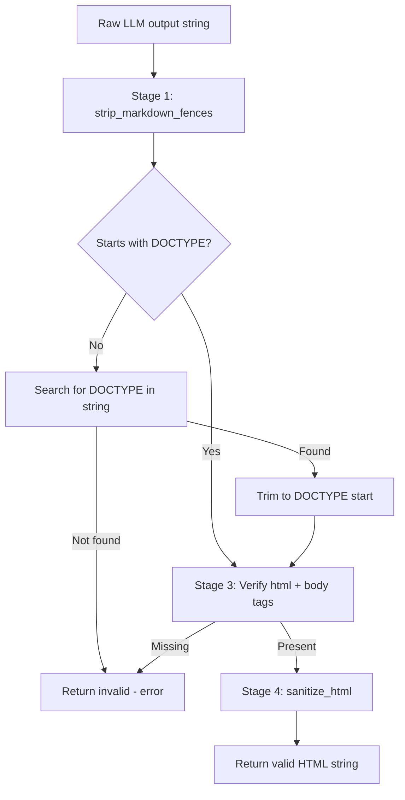
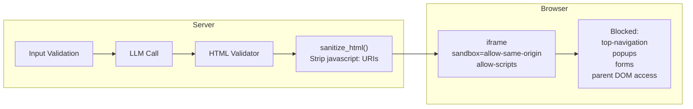

# Instant Dashboard — Complete Technical Documentation

---

## 1. Project Overview

**Instant Dashboard** is a stateless, serverless web application that accepts raw JSON data and a natural-language design prompt, sends them to an OpenAI-compatible LLM API via Server-Sent Events (SSE) streaming, validates the HTML response, and renders a live, interactive dashboard in a sandboxed iframe — all within a single HTTP request lifecycle.

No database. No user accounts. No data persistence. Every request is self-contained.

---

## 2. Technology Stack

| Layer | Technology | Version / Notes |
|-------|-----------|-----------------|
| Language | Python | 3.8+ |
| Web Framework | Flask | ≥ 3.0.0 |
| HTTP Client | requests | ≥ 2.31.0 |
| Env Management | python-dotenv | ≥ 1.0.0 |
| Frontend | Vanilla HTML5 + CSS3 + ES6 JS | No frameworks |
| Typography | Inter (Google Fonts) | Loaded via CDN `@import` |
| LLM API | Any OpenAI-compatible endpoint | Default: OpenCode Zen |
| Deployment | Vercel (serverless) | `vercel.json` configured |

---

## 3. Repository File Map

```
instant-dashboard/
│
├── api/
│   └── index.py              ← Flask app entry point; all routes + SSE retry engine
│
├── config/
│   ├── __init__.py           ← Package marker
│   └── prompts.py            ← SYSTEM_PROMPT (LLM behavior tuning, imported by llm_service)
│
├── services/
│   └── llm_service.py        ← LLM API client; streaming parser; reasoning fallback
│
├── utils/
│   ├── __init__.py           ← Package marker
│   └── validator.py          ← 4-stage HTML validation & sanitisation pipeline
│
├── templates/                ← Jinja2 templates (served by Flask)
│   ├── landing.html          ← Marketing landing page (/, no JS logic)
│   └── generate.html         ← Main generator SPA shell (ES6 module entry: generator.js)
│
├── static/
│   ├── css/
│   │   ├── style.css         ← Import manifest (~35 lines, native @import TOC)
│   │   ├── base/             ← _variables.css, _reset.css, _typography.css
│   │   ├── layout/           ← _grid.css, _navigation.css, _footer.css, _generator-layout.css
│   │   ├── components/       ← _buttons.css, _cards.css, _badges.css, _forms.css, _errors.css,
│   │   │                        _spinner.css, _preview.css, _code-view.css, _history.css
│   │   ├── effects/          ← _backgrounds.css, _animations.css
│   │   └── responsive/       ← _breakpoints.css
│   └── js/
│       ├── generator.js      ← Page orchestrator (state-driven render loop)
│       ├── data/
│       │   └── samples.js    ← Sample JSON datasets & design prompts (pure data, no DOM)
│       ├── utils/
│       │   └── dom.js        ← DOM helpers: showError, hideError, setLoading, validateJSON
│       └── services/
│           └── streamClient.js ← StreamClient class (fetch → SSE parser → callbacks)
│
├── docs/
│   ├── INSTRUCTION_MANUAL.md
│   ├── PROJECT_LOG.md
│   └── project_doc.md        ← This file
│
├── .env                      ← Local secrets (git-ignored)
├── .env.example              ← Template for contributors
├── .gitignore
├── requirements.txt          ← 3 packages: flask, requests, python-dotenv
├── vercel.json               ← Serverless deployment config
└── README.md
```

---

## 4. End-to-End Request Flow

```mermaid
sequenceDiagram
    actor User
    participant Browser as Browser (generator.js)
    participant Flask as Flask (index.py)
    participant LLMSvc as LLM Service (llm_service.py)
    participant Validator as Validator (validator.py)
    participant API as LLM API (OpenCode/NVIDIA)

    User->>Browser: Click "Generate" with JSON + Prompt
    Browser->>Browser: Client-side JSON parse + prompt length check
    Browser->>Flask: POST /api/generate-stream {json_data, user_prompt}
    Flask->>Validator: validate_json_input(json_data)
    Flask->>Validator: validate_prompt(user_prompt)
    Note over Flask: Retry loop starts (max 3 attempts)
    Flask->>LLMSvc: stream_llm(json_data, user_prompt)
    LLMSvc->>API: POST /v1/chat/completions (stream=true)
    API-->>LLMSvc: SSE chunks (delta.content or delta.reasoning)
    LLMSvc-->>Flask: yield chunk strings
    Flask-->>Browser: SSE "data: {chunk}" events
    Browser->>Browser: renderCodeLines() — incremental live view
    LLMSvc-->>Flask: stream complete
    Flask->>Validator: validate_html_output(full_content)
    alt Valid HTML
        Flask-->>Browser: SSE "event: done" with sanitised HTML
        Browser->>Browser: Auto-switch to Preview tab; inject into iframe
    else Invalid (reasoning model, markdown fences, etc.)
        Flask-->>Browser: SSE "event: retry" (if attempts remain)
        Browser->>Browser: Reset live code view, show "Retrying…"
        Note over Flask: Loop retries up to 3 times
    end
    alt All retries exhausted
        Flask-->>Browser: SSE "event: error"
        Browser->>Browser: showError()
    end
```

---

## 5. Module Deep Dive

### 5.1 `api/index.py` — Application Entry Point

**Responsibilities:**
- Configures Flask app with correct `template_folder` and `static_folder` paths (since the file lives in `api/`, not the project root).
- Adds `PROJECT_ROOT` to `sys.path` so sibling packages (`services/`, `utils/`) are importable.
- Defines all URL routes.
- Implements the SSE streaming endpoint with **auto-retry logic**.

**Routes:**

| Route | Method | Handler | Purpose |
|-------|--------|---------|---------|
| `/` | GET | `landing()` | Renders `landing.html` |
| `/generate` | GET | `generate_page()` | Renders `generate.html` |
| `/api/generate` | POST | `api_generate()` | Non-streaming generation (returns full JSON) |
| `/api/generate-stream` | POST | `api_generate_stream()` | SSE streaming endpoint |

**SSE Retry Algorithm (pseudocode):**

```
MAX_ATTEMPTS = 3

function event_stream():
    for attempt in 1..MAX_ATTEMPTS:
        full_content = ""
        try:
            for chunk in stream_llm(json_data, user_prompt):
                full_content += chunk
                yield SSE data event {chunk}

            if full_content is empty:
                if attempt < MAX_ATTEMPTS: continue
                yield SSE error event; return

            html_result = validate_html_output(full_content)

            if html_result is invalid:
                log warning (attempt N/3)
                if attempt < MAX_ATTEMPTS:
                    yield SSE retry event {attempt}  ← client resets live view
                    continue
                yield SSE error event; return

            log success
            yield SSE done event {sanitised_html}
            return

        except Exception:
            yield SSE error event; return
```

**Why retry?** OpenCode Zen uses OpenRouter under the hood. OpenRouter dynamically routes `big-pickle` to different model providers. Sometimes it picks a **reasoning model** (e.g. MiniMax M2.5) that processes the request internally but fails to emit HTML in `delta.content`. A retry causes OpenRouter to re-route to a different, working model.

---

### 5.2 `services/llm_service.py` — LLM Client

**Responsibilities:**
- Builds the request payload and headers.
- Makes a streaming HTTP POST to the configured LLM API endpoint.
- Parses the SSE response line by line.
- Handles reasoning-model fallback.
- Exposes two public functions: `stream_llm()` (generator) and `call_llm()` (aggregator).

**Environment Variables Read:**

| Variable | Default | Purpose |
|----------|---------|---------|
| `LLM_API_KEY` | *(required)* | Bearer token for API |
| `LLM_MODEL` | `minimax-m2.5-free` | Model ID sent in payload |
| `LLM_API_URL` | `https://opencode.ai/zen/v1/chat/completions` | POST endpoint |

**System Prompt (imported from `config/prompts.py`, sent as `role: system`):**

10 strict rules injected before every request. The prompt is maintained in `config/prompts.py` and imported via `from config.prompts import SYSTEM_PROMPT`, keeping prompt tuning separate from execution logic:
1. Output ONLY a valid `<!DOCTYPE html>` document.
2. Use only inline `<style>` tags — no CDNs.
3. No markdown, explanations, or code fences.
4. Use ONLY values from the JSON — no fabrication.
5. Every number must exactly match the source JSON.
6. If data is missing, display "Data Unavailable".
7. Layout must be clean, readable, well-spaced.
8. Follow user's visual instructions precisely.
9. Represent lists/arrays as tables, sections, or visual groupings.
10. Output must be directly renderable in a browser.

**Streaming Parser Algorithm (pseudocode):**

```
chunk_count  = 0
reasoning_buf = ""

for each raw_line in response.iter_lines():
    skip blank lines and SSE comment lines (starting with ":")

    if line starts with "data: ":
        data_str = line[6:]

        if data_str == "[DONE]": break

        chunk_data = JSON.parse(data_str)
        choices = chunk_data["choices"] or []
        if choices is empty: continue          ← guards against IndexError

        delta = choices[0]["delta"]
        content  = delta.get("content", "")
        reasoning = delta.get("reasoning", "") ← reasoning model fallback

        if content:
            chunk_count += 1
            yield content                      ← normal path
        elif reasoning:
            reasoning_buf += reasoning         ← accumulate reasoning text

if chunk_count == 0 and reasoning_buf not empty:
    yield reasoning_buf                        ← fallback: reasoning model output
```

**Why the reasoning fallback?** MiniMax M2.5 and similar CoT (chain-of-thought) models stream their thinking into `delta.reasoning` while leaving `delta.content` empty throughout. The fallback captures this full reasoning text and passes it to the validator, which then extracts the `<!DOCTYPE html>` portion if present (the model typically includes the HTML inside its reasoning output).

---

### 5.3 `utils/validator.py` — Validation & Sanitisation Pipeline

**Four-stage pipeline applied to every LLM response:**



**Stage 1 — `strip_markdown_fences(html)`:**

Many LLMs wrap HTML in ` ```html ... ``` ` or add preamble text like "Here is your dashboard:". The improved regex uses `re.search()` (not `re.match()`) to find the fence block *anywhere* in the string:

```python
# Primary: find ```html ... ``` block anywhere
fence_match = re.search(
    r"```(?:html|HTML)?[ \t]*\r?\n([\s\S]*?)\n?[ \t]*```",
    stripped
)
if fence_match:
    return fence_match.group(1).strip()

# Fallback: strip leading/trailing fence lines only
stripped = re.sub(r"^```(?:html|HTML)?[ \t]*\r?\n?", "", stripped)
stripped = re.sub(r"\n?```[ \t]*$", "", stripped)
```

**Stage 2 — DOCTYPE check:**

```python
if not re.match(r"<!DOCTYPE\s+html", html, re.IGNORECASE):
    doctype_match = re.search(r"<!DOCTYPE\s+html", html[:500], re.IGNORECASE)
    if doctype_match:
        html = html[doctype_match.start():]   # trim preamble before DOCTYPE
    else:
        return {"valid": False, "error": "LLM did not return valid HTML."}
```

**Stage 3 — Structure check:** Verifies presence of `<html` and `<body` tags.

**Stage 4 — `sanitize_html(html)`:**

Only strips `javascript:` protocol URIs. Inline `<script>` blocks and `on*` event handlers are **intentionally kept** — the sandboxed iframe provides the security boundary, and generated dashboards need JS for interactivity (charts, toggles, animations).

```python
# Strip javascript: href
sanitized = re.sub(r'href\s*=\s*"javascript:[^"]*"', 'href="#"', ...)
sanitized = re.sub(r"href\s*=\s*'javascript:[^']*'", "href='#'", ...)
sanitized = re.sub(r'src\s*=\s*"javascript:[^"]*"', 'src=""', ...)
```

---

### 5.4 `static/js/` — Client-Side Engine (ES6 Modules)

The frontend uses **ES6 modules** loaded via `<script type="module">`. The monolithic script has been decomposed into four focused files with clean separation of concerns:

```
js/
├── generator.js              ← Page orchestrator
├── data/samples.js           ← Pure data (no DOM)
├── utils/dom.js              ← DOM helpers (no state)
└── services/streamClient.js  ← Network layer (no DOM)
```

#### 5.4a `data/samples.js` — Sample Data Module

Pure data module — no DOM or side-effect dependencies. Exports two objects:

- **`SAMPLES`**: Three JSON datasets (stringified with pretty-print):

| Key | JSON Dataset | Content |
|-----|-------------|----------------------|
| `sales` | TechCorp Q4 2025 | Revenue, expenses, profit, departments, products, monthly revenue |
| `analytics` | dashboard.app Jan 2026 | Visitors, page views, bounce rate, traffic sources, top pages, devices |
| `hr` | GlobalTech Solutions Feb 2026 | Headcount, hires, attrition, departments with salaries, diversity |

- **`SAMPLE_PROMPTS`**: Matching design prompt strings for each dataset.

#### 5.4b `utils/dom.js` — DOM Utility Functions

Four exported functions. All receive their DOM targets as **arguments** (no module-level queries), making them testable and reusable:

| Function | Signature | Purpose |
|----------|-----------|--------|
| `showError()` | `(containerEl, textEl, msg)` | Sets `textContent` + adds `.error-message--visible` class |
| `hideError()` | `(containerEl)` | Removes `.error-message--visible` class |
| `setLoading()` | `(btnEl, textEl, spinnerEl, isLoading)` | Toggles button disabled/text/spinner |
| `validateJSON()` | `(str)` → `{valid, error?}` | `JSON.parse()` in try/catch |

#### 5.4c `services/streamClient.js` — SSE Streaming Client

Exports the `StreamClient` class. Zero DOM knowledge — communicates results via callbacks.

**Constructor:** `new StreamClient(url)` — takes the API endpoint (e.g. `/api/generate-stream`).

**`stream(payload, callbacks)` method:**

```
async stream(payload, { onChunk, onRetry, onDone, onError }):
    response = await fetch(url, POST, JSON body)

    if !response.ok → parse error JSON → onError(msg) → return

    reader = response.body.getReader()
    buffer = ''

    while read():
        buffer += decode(value)
        events = buffer.split('\n\n')
        buffer = events.pop()          ← keep incomplete chunk

        for each eventBlock:
            parse 'event: <type>' and 'data: <json>'

            'error'  → onError(parsed.error) → return
            'retry'  → onRetry(parsed) → continue
            'done'   → onDone(parsed.html) → return
            default  → onChunk(parsed.chunk)

    onError('Stream ended unexpectedly.')
```

Guards: `AbortError` → timeout message; other errors → network error message.

#### 5.4d `generator.js` — Page Orchestrator

Imports all three modules and wires them together via a **centralized state object** and a **single `render()` function**.

**Imports:**
```javascript
import { SAMPLES, SAMPLE_PROMPTS } from './data/samples.js';
import { showError, hideError, setLoading, validateJSON } from './utils/dom.js';
import { StreamClient } from './services/streamClient.js';
```

**State object:**

| Key | Type | Purpose |
|-----|------|---------|
| `isGenerating` | `boolean` | Controls button disabled state and spinner |
| `view` | `'code'\|'preview'` | Active tab |
| `streamStatus` | `'idle'\|'streaming'\|'retrying'\|'done'\|'error'` | Status indicator dot + label |
| `errorMessage` | `string\|null` | Error banner content |
| `generatedHTML` | `string\|null` | Final sanitised HTML for preview/download |
| `rawCode` | `string` | Accumulated raw chunks for live code view |
| `charCount` | `number` | Character count displayed in stats bar |
| `iframeSrcdocSet` | `boolean` | Guards against iframe reload on tab switches |

**`render()` function:** Single function that reconciles the entire UI from `state`. Every user action or stream callback mutates state, then calls `render()`. Handles:
- Generate button loading state
- Error display show/hide
- Download button visibility
- Stats bar (char count, streaming dot color + label)
- Tab active states
- Panel visibility (placeholder / code view / preview iframe)
- Iframe srcdoc injection (guarded by `iframeSrcdocSet`)

**`renderCodeLines(code)` — Incremental DOM rendering (XSS-proof):**

Uses **programmatic DOM construction** with `textContent` exclusively — no `innerHTML` — making it 100% XSS-proof regardless of LLM output. Uses a `renderedLineCount` cursor:
1. **Update last line** (may have been a partial line from previous chunk) via `textContent`.
2. **Append only new lines** using `DocumentFragment` + `document.createElement()` (batched DOM insert — no reflow per line).
3. Increment `renderedLineCount`.

**`handleSubmit()` flow:**
1. Client-side validation (JSON parse + prompt checks)
2. Reset state to `streaming`, clear code view
3. Call `client.stream()` with 4 callbacks:
   - `onChunk` → append to `rawCode`, call `renderCodeLines()`, auto-scroll
   - `onRetry` → reset code view, set status to `retrying`
   - `onDone` → store HTML, set `done`, auto-switch to preview after 800ms
   - `onError` → set error message
4. Safety catch: if stream ends without `onDone`/`onError`, force error state

---

### 5.5 `templates/landing.html` — Landing Page

Static marketing page. No JavaScript. Sections:

1. **Hero** — headline, CTA buttons ("Generate Dashboard", "Learn More"), animated preview mockup (pure CSS/HTML bars, no images).
2. **Features** (`#features`) — 6 feature cards: AI Generation, Data Integrity, Sandboxed Rendering, Custom Styling, Instant Results, Export Ready.
3. **How It Works** (`#how-it-works`) — 3 step cards: Paste JSON → Describe Style → Get Dashboard.
4. **Footer** — stateless disclaimer.

Background: animated floating gradient orbs (`orbFloat1/2/3` keyframes) + subtle grid overlay.

---

### 5.6 `templates/generate.html` — Generator UI Shell

SPA shell rendered by Flask's Jinja2. Contains:

- **Sidebar** (`aside.generator-sidebar`):
  - JSON textarea (`#json-input`, monospace font, 220px min-height)
  - Sample buttons: Sales Data, Analytics, HR Report, Clear
  - Prompt textarea (`#prompt-input`, 500 char max, live counter)
  - Error message box (hidden by default, animated slideIn)
  - Generate button (with spinner), Download button

- **Main preview area** (`main.generator-main`):
  - Toolbar (hidden until first generation): macOS-style traffic light dots, Code/Preview tabs, char stats + streaming status dot
  - Placeholder (shown before any generation)
  - Live code view (`div.live-code-view`) — scrollable dark code editor look
  - Preview iframe: `sandbox="allow-same-origin allow-scripts"` — allows JS execution while blocking top-level navigation, popups, form submissions to external URLs

The `sandbox` attribute values explained:
- `allow-same-origin` — iframe can access its own DOM (needed for height calculation via `contentDocument`)
- `allow-scripts` — allows `<script>` blocks in generated HTML to execute (charts, toggles, animations)
- *Omitted*: `allow-popups`, `allow-top-navigation`, `allow-forms` — prevents the generated code from redirecting the parent page or opening windows

---

### 5.7 `static/css/` — Design System (Modular)

The design system uses **native CSS `@import`** for modularisation. The main `style.css` is a ~35-line import manifest; the browser resolves paths relative to it.

**Module structure:**

| Directory | Files | Purpose |
|-----------|-------|---------|
| `base/` | `_variables.css`, `_reset.css`, `_typography.css` | Design tokens, box-model reset, heading/text utilities |
| `layout/` | `_grid.css`, `_navigation.css`, `_footer.css`, `_generator-layout.css` | Page structure and navigation |
| `components/` | `_buttons.css`, `_cards.css`, `_badges.css`, `_forms.css`, `_errors.css`, `_spinner.css`, `_preview.css`, `_code-view.css`, `_history.css` | UI components |
| `effects/` | `_backgrounds.css`, `_animations.css` | Background orbs, fade-in animations |
| `responsive/` | `_breakpoints.css` | All `@media` queries (1024px, 768px, 480px) |

**Design Tokens (`base/_variables.css`):**

| Category | Variables | Example Values |
|----------|-----------|----------------|
| Backgrounds | `--bg-primary/secondary/tertiary/card/glass` | `#0a0e1a`, `rgba(20,28,51,0.65)` |
| Accents | `--accent-primary/secondary/glow/gradient` | `#6366f1`, indigo-purple-lavender gradient |
| Text | `--text-primary/secondary/muted/accent` | `#f1f5f9`, `#94a3b8`, `#64748b` |
| Borders | `--border-subtle/accent` | `rgba(255,255,255,0.06)` |
| Shadows | `--shadow-sm/md/lg/glow` | Includes indigo glow effect |
| Radius | `--radius-sm/md/lg/xl` | 8px → 24px |
| Transitions | `--transition-fast/normal/slow` | `150ms cubic-bezier(0.4,0,0.2,1)` |

**Key animations (across `effects/` and `components/`):**

| Keyframe | File | Effect |
|----------|------|--------|
| `orbFloat1/2/3` | `effects/_backgrounds.css` | Slow float, 18–25s loops |
| `pulse-dot` | `components/_badges.css` | Pulse opacity + scale |
| `pulseDot` | `components/_preview.css` | Amber pulse during generation |
| `spin` | `components/_spinner.css` | 360° rotation, 0.75s |
| `slideIn` | `components/_errors.css` | Fade + translateY(-8px→0) |
| `fadeInUp` | `effects/_animations.css` | Staggered entrance animation |

**Generator-specific components:**

- `.generator-layout` (`layout/_generator-layout.css`) — CSS Grid: `420px sidebar | 1fr main`
- `.live-code-view` (`components/_code-view.css`) — `display: table` container; each `.code-line` is `display: table-row`; `.code-line__num` is sticky left column (line numbers); `.code-line__text` is `white-space: pre` to preserve indentation
- `.preview-stats__dot--streaming` (`components/_preview.css`) — amber pulsing dot; `--done` = green glow; `--error` = red glow
- `.btn--sample` (`components/_buttons.css`) — small pill buttons below JSON textarea
- `.char-counter` (`components/_forms.css`) — turns amber at 450 chars, red at 500 chars

---

## 6. Overall System Algorithm

```
INPUT: json_data (string), user_prompt (string)

=== CLIENT SIDE ===
1. Parse json_data with JSON.parse() → reject if invalid
2. Trim user_prompt → reject if empty or > 500 chars
3. Open SSE connection: fetch POST /api/generate-stream
4. Show live code view; start streaming status indicator

=== SERVER SIDE ===
5. Flask receives POST, re-validates JSON + prompt length
6. Start retry loop (attempt = 1 to 3):

   6a. Build payload:
       - system: SYSTEM_PROMPT (10 rules)
       - user: "Here is the JSON:\n```json\n{json_data}\n```\nDesign: {prompt}"
       - model: LLM_MODEL, max_tokens: 8000, temperature: 0.3, top_p: 0.7, stream: true

   6b. POST to LLM_API_URL with Bearer auth, timeout=120s

   6c. Stream response line by line:
       - Skip blank lines and ": OPENROUTER PROCESSING" comment lines
       - Parse each "data: {...}" JSON chunk
       - If choices[] is empty → skip (prevents IndexError)
       - Extract delta.content; if empty, extract delta.reasoning (fallback)
       - Yield content chunks to Flask generator

   6d. Flask forwards each chunk as SSE "data: {chunk}" to browser

   6e. After stream ends:
       - If content was from reasoning fallback → yield full reasoning_buf as one chunk

   6f. Validate accumulated full_content:
       - strip_markdown_fences() → regex search for ```html block anywhere
       - Find <!DOCTYPE html> → trim preamble if needed
       - Verify <html> and <body> present
       - sanitize_html() → strip javascript: URIs only

   6g. If INVALID and attempt < 3:
       - Send SSE "event: retry" → browser resets live view → loop

   6h. If VALID:
       - Send SSE "event: done" with sanitised HTML → exit loop

   6i. If INVALID after 3 attempts:
       - Send SSE "event: error"

=== CLIENT SIDE (after done event) ===
7. Store generatedHTML
8. After 800ms delay, switchView('preview')
9. Set iframe.srcdoc = generatedHTML (once, guarded by iframeSrcdocSet flag)
10. iframe.onload → auto-resize to content scroll height
11. Show Download button → on click, create Blob URL, trigger <a> download
```

---

## 7. Security Model



| Threat | Mitigation |
|--------|-----------|
| XSS via `javascript:` href | Stripped by `sanitize_html()` regex |
| Malicious JSON injection | Server-side `json.loads()` parse before LLM call |
| Prompt overflow | 500 char limit enforced client + server |
| LLM hallucinating data | System prompt rule 4+5: use ONLY provided JSON values |
| Generated page hijacking parent | iframe sandbox blocks `allow-top-navigation`, `allow-popups` |
| Generated page accessing parent DOM | CSP same-origin sandboxing |
| LLM API key exposure | Loaded from `.env`, never sent to client |

---

## 8. Package Reference

| Package | Version Constraint | Why Used |
|---------|-------------------|----------|
| `flask` | ≥ 3.0.0 | HTTP routing, Jinja2 templating, `Response` with `text/event-stream` mimetype for SSE |
| `requests` | ≥ 2.31.0 | Blocking HTTP POST to LLM API with `stream=True`; `response.iter_lines()` for SSE parsing |
| `python-dotenv` | ≥ 1.0.0 | `load_dotenv()` in `__main__` block reads `.env` file into `os.environ` for local dev |

Python stdlib modules used (no install needed):
- `json` — parse/serialize SSE chunk data and API payloads
- `os` — read environment variables
- `re` — regex for markdown fence stripping, DOCTYPE detection, URI sanitisation
- `logging` — structured log output at INFO/WARNING/ERROR levels
- `sys` — `sys.path.insert()` to make project root importable from `api/` subdirectory

---

## 9. Deployment (Vercel)

The `vercel.json` configuration maps all routes to the Flask WSGI handler in `api/index.py`, enabling zero-config serverless deployment. Environment variables must be set in the Vercel project dashboard (not the `.env` file which is git-ignored).

**Limitations on Vercel free tier:**
- Function timeout: 10s (Hobby) or 60s (Pro). LLM streaming can take 30–90s → Pro plan or a different host recommended.
- No filesystem persistence — not relevant here since the app is fully stateless.

---

## 10. LLM Provider Compatibility

The service layer is provider-agnostic. Any OpenAI-compatible endpoint works:

| Provider | Endpoint | Notes |
|----------|---------|-------|
| **OpenCode Zen** *(default)* | `https://opencode.ai/zen/v1/chat/completions` | Routes via OpenRouter; free; may pick reasoning models → retry handles this |
| **NVIDIA NIM** | `https://integrate.api.nvidia.com/v1/chat/completions` | Free tier; `top_p` required; 4096 output token cap; reliable content streaming |
| **OpenRouter direct** | `https://openrouter.ai/api/v1/chat/completions` | Full model catalogue; pay-per-use |
| **OpenAI** | `https://api.openai.com/v1/chat/completions` | GPT-4o recommended for dashboard quality |

**Reasoning model handling:**
Some models (MiniMax M2.5, DeepSeek R1, etc.) stream thinking in `delta.reasoning` and leave `delta.content` empty. The service accumulates `delta.reasoning` and falls back to it if `chunk_count == 0`. The validator then extracts the HTML portion from within the reasoning text.
