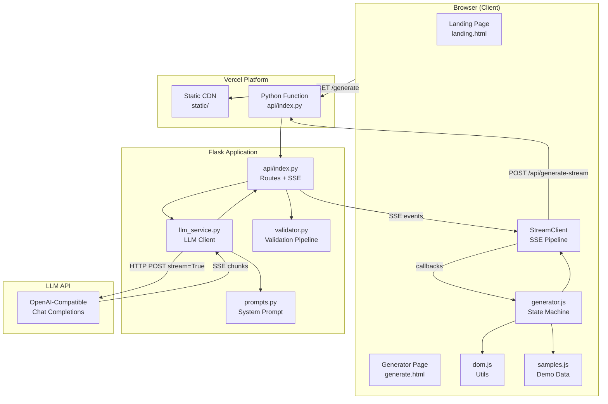
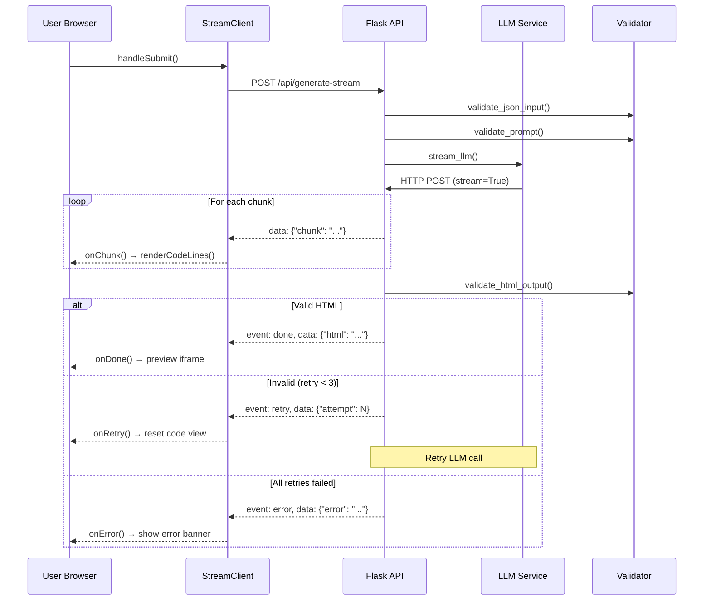
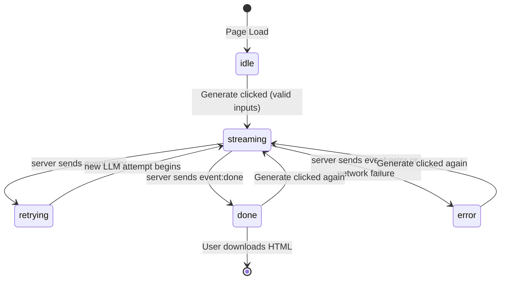
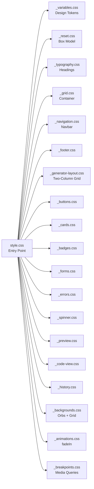
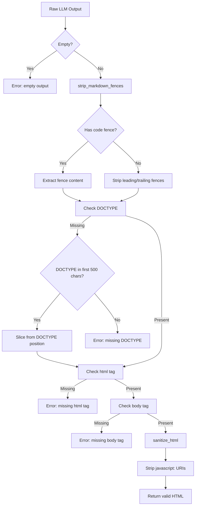

# Instant Dashboard — Comprehensive Technical Documentation

> **Last updated:** 2026-05-22
> **Scope:** Full line-by-line codebase audit, architecture deep-dive, and API reference.

---

## Table of Contents

1. [Project Overview](#1-project-overview)
2. [Tech Stack (In Depth)](#2-tech-stack-in-depth)
3. [Directory Structure](#3-directory-structure)
4. [System Architecture and Data Flow](#4-system-architecture-and-data-flow)
5. [Backend — Module-by-Module](#5-backend--module-by-module)
6. [Frontend — Module-by-Module](#6-frontend--module-by-module)
7. [CSS Design System — Module-by-Module](#7-css-design-system--module-by-module)
8. [API Endpoints — Full Reference](#8-api-endpoints--full-reference)
9. [SSE Event Protocol](#9-sse-event-protocol)
10. [Environment Variables and Configuration](#10-environment-variables-and-configuration)
11. [Deployment — Vercel Serverless](#11-deployment--vercel-serverless)
12. [Security Model](#12-security-model)
13. [Pseudocode Algorithms](#13-pseudocode-algorithms)
14. [Mermaid Architecture Diagrams](#14-mermaid-architecture-diagrams)
15. [Functions, Classes, and Exports Reference](#15-functions-classes-and-exports-reference)
16. [Known Patterns and Design Decisions](#16-known-patterns-and-design-decisions)

---

## 1. Project Overview

**Instant Dashboard** is a stateless, AI-powered web application that converts raw JSON data into fully rendered, self-contained HTML dashboards in real time. Users paste any structured JSON, describe their visual preferences in plain English, and within seconds receive a production-ready dashboard streamed live to their browser — with zero code required.

### Core Value Proposition

| Pain Point | Instant Dashboard Answer |
|---|---|
| BI tools require expensive licenses and engineers | Zero-cost, zero-setup HTML generation |
| Raw JSON is unreadable by non-technical stakeholders | Transforms it into a visual, styled dashboard |
| Custom charting requires hours of dev work | LLM generates complete, self-contained HTML and CSS |
| Data accuracy is hard to guarantee | System prompt enforces a strict zero-hallucination rule |

### Key Design Principles

1. **Stateless** — No session, no database, no user data persisted at any stage.
2. **Streaming-first** — Code is pushed character-by-character via SSE so users see progress instantly.
3. **Sandboxed output** — Generated HTML is rendered in a `sandbox` iframe, preventing XSS and parent-frame manipulation.
4. **Auto-retry** — Up to 3 automatic retries if the LLM returns empty or invalid content.
5. **Provider-agnostic** — Any OpenAI-compatible API endpoint works; model and URL are fully configurable.

---

## 2. Tech Stack (In Depth)

### 2.1 Backend

| Technology | Version | Role |
|---|---|---|
| **Python** | 3.10+ | Runtime language |
| **Flask** | >= 3.0.0 | WSGI web framework; page routes, API routes, SSE response streaming |
| **requests** | >= 2.31.0 | HTTP client for outbound LLM API calls with `stream=True` |
| **python-dotenv** | >= 1.0.0 | Loads `.env` variables into `os.environ` for local development |
| **logging** | stdlib | Structured console logging at `INFO` / `WARNING` / `ERROR` levels |
| **json** | stdlib | JSON serialisation/deserialisation for SSE payloads and chunk parsing |
| **re** | stdlib | Regex-based markdown-fence stripping and `javascript:` URI sanitisation |
| **os / sys** | stdlib | Path computation, `sys.path` manipulation for module discovery |

### 2.2 Frontend

| Technology | Role |
|---|---|
| **HTML5** | Semantic page structure; Jinja2 templates rendered server-side by Flask |
| **Vanilla CSS3** | Full design system split into 19 partial files — no CSS framework used |
| **JavaScript ES2022 (ESM)** | Native ES Modules (`import`/`export`), `async/await`, Fetch API, `ReadableStream` |
| **Google Fonts — Inter** | Primary sans-serif typeface, weights 300–900, loaded via `@import` |
| **SVG (inline)** | All icons are inline SVG — no icon library dependency |

### 2.3 LLM / AI Layer

| Provider | API Compatibility | Default Model |
|---|---|---|
| **OpenCode Zen** | OpenAI Chat Completions v1 | `minimax-m2.5-free` |
| **NVIDIA NIM** | OpenAI Chat Completions v1 | `meta/llama-3.1-8b-instruct` |
| Any OpenAI-compatible host | `POST /v1/chat/completions` with `stream: true` | Configurable |

The service layer streams from `choices[0].delta.content`. A fallback to `delta.reasoning` handles reasoning-only models that emit their output in the reasoning field instead of the content field.

### 2.4 Infrastructure and Deployment

| Technology | Role |
|---|---|
| **Vercel v2** | Serverless deployment platform |
| **@vercel/python** | Wraps `api/index.py` as a serverless Python function (WSGI) |
| **@vercel/static** | Serves `static/**` directly from Vercel's CDN edge layer |
| **vercel.json** | Defines build rules and URL routing (static assets vs. Python function) |

---

## 3. Directory Structure

```
instant-dashboard/
|
|-- api/
|   |-- index.py                    # Flask app: all routes + SSE streaming + retry logic
|
|-- config/
|   |-- __init__.py                 # Empty package marker (makes config/ importable)
|   |-- prompts.py                  # SYSTEM_PROMPT string constant
|
|-- services/
|   |-- __init__.py                 # Empty package marker
|   |-- llm_service.py              # _build_payload(), stream_llm(), call_llm()
|
|-- utils/
|   |-- __init__.py                 # Empty package marker
|   |-- validator.py                # validate_json_input(), validate_prompt(),
|                                   # strip_markdown_fences(), sanitize_html(),
|                                   # validate_html_output()
|
|-- templates/
|   |-- landing.html                # Marketing landing page (served at GET /)
|   |-- generate.html               # Generator UI (served at GET /generate)
|
|-- static/
|   |-- css/
|   |   |-- style.css               # CSS @import manifest (entry point)
|   |   |-- base/
|   |   |   |-- _variables.css      # CSS custom properties (design tokens)
|   |   |   |-- _reset.css          # Box-model reset, scrollbar, body base
|   |   |   |-- _typography.css     # .heading-xl, .heading-lg, .text-gradient, .text-body
|   |   |-- layout/
|   |   |   |-- _grid.css           # .container, .section, .section--hero
|   |   |   |-- _navigation.css     # .nav glassmorphism fixed navbar
|   |   |   |-- _footer.css         # .footer layout
|   |   |   |-- _generator-layout.css  # .generator-layout two-column CSS grid
|   |   |-- components/
|   |   |   |-- _buttons.css        # .btn, .btn--primary, .btn--secondary, .btn--sample
|   |   |   |-- _cards.css          # .card, .feature-card, .step-card, grids
|   |   |   |-- _badges.css         # .badge with animated pulse dot
|   |   |   |-- _forms.css          # .form-group, .form-textarea, .char-counter
|   |   |   |-- _errors.css         # .error-message slide-in alert banner
|   |   |   |-- _spinner.css        # .spinner CSS animation
|   |   |   |-- _preview.css        # .preview-container, tabs, stats bar, iframe
|   |   |   |-- _code-view.css      # .live-code-view line-by-line table layout
|   |   |   |-- _history.css        # .history-item (CSS reserved for future use)
|   |   |-- effects/
|   |   |   |-- _backgrounds.css    # .bg-grid + .bg-gradient-orb floating animations
|   |   |   |-- _animations.css     # .fade-in with delay variants
|   |   |-- responsive/
|   |       |-- _breakpoints.css    # All media queries (1024px, 768px, 480px)
|   |-- js/
|       |-- generator.js            # ES module orchestrator (state machine + render loop)
|       |-- data/
|       |   |-- samples.js          # SAMPLES + SAMPLE_PROMPTS exports
|       |-- services/
|       |   |-- streamClient.js     # StreamClient class (SSE fetch pipeline)
|       |-- utils/
|           |-- dom.js              # showError(), hideError(), setLoading(), validateJSON()
|
|-- docs/
|   |-- project_doc.md              # This file
|
|-- .env                            # Local secrets (gitignored)
|-- .env.example                    # Environment variable template
|-- .gitignore                      # Git ignore rules
|-- requirements.txt                # Python dependencies (flask, requests, python-dotenv)
|-- vercel.json                     # Vercel build + routing configuration
|-- README.md                       # Project README with setup instructions
```

---

## 4. System Architecture and Data Flow

### 4.1 High-Level Request Flow

Every user interaction follows this deterministic path:

```
Browser (User)
   |
   |--[1] GET /           --> Flask renders landing.html
   |--[1] GET /generate   --> Flask renders generate.html
   |
   |--[2] POST /api/generate-stream  (JSON body: {json_data, user_prompt})
          |
          |--[3] Flask: validate_json_input(json_data)    --> reject if not valid JSON
          |--[4] Flask: validate_prompt(user_prompt)       --> reject if empty or >500 chars
          |
          |--[5] Flask opens SSE Response (text/event-stream, no-cache)
          |       |
          |       |--[6] stream_llm(json_data, user_prompt)
          |               |
          |               |-- Build payload:
          |               |     SYSTEM_PROMPT (from config/prompts.py)
          |               |     + user message with JSON data embedded
          |               |
          |               |-- POST to LLM API (requests, stream=True, timeout=120s)
          |               |
          |               |-- Iterate response.iter_lines():
          |                     Parse "data: {...}" SSE lines from LLM
          |                     Extract delta.content (or delta.reasoning fallback)
          |                     yield chunk (str)
          |
          |--[7] Flask SSE loop (up to 3 attempts):
          |       For each chunk: emit "data: {chunk: ...}\n\n"
          |       On stream end:
          |         validate_html_output(full_content):
          |           strip_markdown_fences()
          |           check <!DOCTYPE html>
          |           check <html> and <body> tags
          |           sanitize_html() -- remove javascript: URIs
          |         If valid:          emit "event: done\ndata: {html: ...}\n\n"
          |         If invalid + retries left: emit "event: retry\n..." and loop
          |         If invalid + no retries:   emit "event: error\ndata: {...}\n\n"
          |
   |--[8] Browser StreamClient reads ReadableStream
          |
          |-- TextDecoder decodes bytes to string
          |-- Split on "\n\n" to extract complete SSE event blocks
          |-- Parse event type and data JSON from each block
          |-- Call callbacks:
               onChunk(chunk)  --> generator.js appends lines to live code view
               onRetry(parsed) --> generator.js resets code view for retry
               onDone(html)    --> generator.js stores HTML, auto-switches to preview
               onError(msg)    --> generator.js displays error message
```

### 4.2 Frontend State Machine

`generator.js` manages a single `state` object. Every action mutates state then calls the single `render()` function, which reconciles the entire UI from that state snapshot.

```
State Shape:
{
  isGenerating:    boolean         -- controls button disabled + spinner visibility
  view:            'code'|'preview' -- which panel is active
  streamStatus:    'idle'|'streaming'|'retrying'|'done'|'error'
  errorMessage:    string|null     -- displayed in error banner
  generatedHTML:   string|null     -- final sanitised HTML from server
  rawCode:         string          -- accumulated raw code chunks from stream
  charCount:       number          -- length of rawCode
  iframeSrcdocSet: boolean         -- guard: prevents re-setting srcdoc on each render()
}

State Transitions:
  idle        -> streaming   (user clicks Generate, all validations pass)
  streaming   -> retrying    (server sends "event: retry")
  retrying    -> streaming   (server begins re-streaming after retry)
  streaming   -> done        (server sends "event: done")
  streaming   -> error       (server sends "event: error" or network failure)
  done        -> streaming   (user clicks Generate again for a new dashboard)
  error       -> streaming   (user clicks Generate again after an error)
```

### 4.3 CSS Architecture (ITCSS-Inspired Layering)

The CSS is split into layers following specificity order:

```
style.css (import manifest — @import each partial in order)
  |-- base/        (design tokens, reset, typography)   -- lowest specificity
  |-- layout/      (structural containers and grids)
  |-- components/  (reusable UI widgets)
  |-- effects/     (animations, background decorations)
  |-- responsive/  (media query overrides)              -- highest specificity
```

Each partial file is prefixed with `_` (SCSS naming convention) for clarity. All partials are vanilla CSS — no preprocessor is used. The `@import url(...)` syntax in `style.css` composes all partials in dependency order.

---

## 5. Backend — Module-by-Module

---

### 5.1 `api/index.py` — Flask Entry Point

**Purpose:** The single Python entry point for the entire application. Defines the Flask `app` instance, configures all routes (page + API), and contains the SSE streaming generator with retry logic.

**File size:** 207 lines

#### Imports and Path Setup (Lines 1–20)

```python
import os, sys, json, logging
from flask import Flask, request, jsonify, render_template, Response
```

- `os.path.dirname(os.path.dirname(os.path.abspath(__file__)))` — Computes the project root by going two directories up from `api/index.py`. This is necessary because Vercel and local runs both execute from `api/`, so `PROJECT_ROOT` must be computed dynamically.
- `sys.path.insert(0, PROJECT_ROOT)` — Prepends project root to Python's module search path so that `services.llm_service` and `utils.validator` can be imported without install.
- `from services.llm_service import call_llm, stream_llm` — LLM interaction functions.
- `from utils.validator import validate_json_input, validate_prompt, validate_html_output` — Validation pipeline functions.

#### Flask App Configuration (Lines 31–35)

```python
app = Flask(
    __name__,
    template_folder=os.path.join(PROJECT_ROOT, "templates"),
    static_folder=os.path.join(PROJECT_ROOT, "static"),
)
```

- `template_folder` and `static_folder` are explicitly set using absolute paths derived from `PROJECT_ROOT`. This is critical for Vercel deployment where the working directory is `api/`, not the project root.

#### Page Routes (Lines 42–51)

```python
@app.route("/")
def landing():
    return render_template("landing.html")

@app.route("/generate")
def generate_page():
    return render_template("generate.html")
```

- Both routes are simple `GET` handlers returning Jinja2-rendered HTML templates.
- No template context variables are passed — both templates are purely static HTML.

#### `POST /api/generate` — Non-Streaming Endpoint (Lines 58–103)

This endpoint generates a complete dashboard and returns the full HTML in a single JSON response.

**Request parsing (lines 67–76):**
- `request.get_json(force=True)` — Parses body as JSON regardless of `Content-Type` header.
- `body.get("json_data", "")` and `body.get("user_prompt", "")` — Extract fields with empty-string defaults (validation will catch empty values).

**Validation (lines 79–86):**
- Calls `validate_json_input()` and `validate_prompt()` in sequence. Either failure returns `400`.

**LLM call (lines 89–93):**
- `call_llm(json_data, user_prompt)` — Internally streams and concatenates all chunks. Returns `{"success": bool, "html": str}` or `{"success": bool, "error": str}`.
- LLM failure returns `500`.

**Output validation (lines 96–103):**
- `validate_html_output()` strips markdown, validates structure, sanitises. Failure returns `500`.
- Success returns `200` with `{"success": True, "html": "<clean html>"}`.

#### `POST /api/generate-stream` — SSE Streaming Endpoint (Lines 106–195)

This is the primary production endpoint. It returns a `text/event-stream` response.

**Validation (lines 118–137):** Identical validation steps as non-streaming, but failures return `400` JSON (non-SSE) because the SSE stream hasn't started yet.

**Retry constant (line 141):** `MAX_ATTEMPTS = 3` — The server will attempt up to 3 full LLM calls before yielding a terminal error event.

**`event_stream()` generator (lines 143–184):** A Python generator function that yields SSE-formatted strings:

```python
for attempt in range(1, MAX_ATTEMPTS + 1):
    full_content = ""
    for chunk in stream_llm(json_data, user_prompt):
        full_content += chunk
        yield f"data: {json.dumps({'chunk': chunk})}\n\n"
    
    # After stream ends, validate the accumulated HTML
    html_result = validate_html_output(full_content)
    if html_result["valid"]:
        yield f"event: done\ndata: {json.dumps({'html': html_result['html']})}\n\n"
        return
    elif attempt < MAX_ATTEMPTS:
        yield f"event: retry\ndata: {json.dumps({'attempt': attempt})}\n\n"
        # Loop continues to next attempt
    else:
        yield f"event: error\ndata: {json.dumps({'error': html_result['error']})}\n\n"
        return
```

Key insight: each chunk is yielded **immediately** as it arrives from the LLM, so the browser sees the code appearing character-by-character. The full HTML is only validated **after** the complete stream ends.

**Flask `Response` wrapping (lines 187–195):**

```python
return Response(
    event_stream(),
    mimetype="text/event-stream",
    headers={
        "Cache-Control": "no-cache",
        "X-Accel-Buffering": "no",    # Disables Nginx proxy buffering
        "Connection": "keep-alive",
    },
)
```

- `X-Accel-Buffering: no` is a critical header for SSE through Nginx/Vercel proxies — without it, the proxy may buffer the entire response before forwarding, destroying the streaming effect.

#### Local Dev Entry Point (Lines 202–206)

```python
if __name__ == "__main__":
    from dotenv import load_dotenv
    load_dotenv(os.path.join(PROJECT_ROOT, ".env"))
    app.run(debug=True, port=5000)
```

- `python-dotenv` is only imported here, keeping it out of the Vercel runtime where environment variables are set via the dashboard.

---

### 5.2 `services/llm_service.py` — LLM Service Layer

**Purpose:** Encapsulates all LLM API communication. Implements a streaming SSE client over the OpenAI Chat Completions protocol. Provides two public functions: `stream_llm` (generator) and `call_llm` (aggregate).

**File size:** 201 lines

#### `_build_payload(json_data, user_prompt) -> tuple` (Lines 18–63)

Private helper that reads configuration from environment variables and constructs the request.

```python
api_key = os.environ.get("LLM_API_KEY")         # Required
model   = os.environ.get("LLM_MODEL", "minimax-m2.5-free")
api_url = os.environ.get("LLM_API_URL", "https://opencode.ai/zen/v1/chat/completions")
```

The **user message** is formatted as:

```
Here is the JSON data for the dashboard:

```json
{json_data}
```

Design instructions: {user_prompt}
```

This structured format ensures the LLM clearly delineates data from instructions.

**Payload constants:**
- `max_tokens: 8000` — Allows for large, complex HTML documents.
- `temperature: 0.3` — Low temperature for deterministic, structured output.
- `top_p: 0.7` — Further constrains token selection for consistency.
- `stream: True` — Always true; `call_llm()` consumes the stream internally.

Returns `(headers, payload, api_url)` tuple.

#### `stream_llm(json_data, user_prompt)` — Generator (Lines 66–167)

Yields individual content chunks from the LLM as they arrive.

**HTTP call (lines 84–91):**
```python
response = requests.post(
    api_url, headers=headers, json=payload,
    timeout=120, stream=True
)
```
- `timeout=120` — 2 minutes max for the initial connection. Stream duration itself is not limited.
- `stream=True` — Tells `requests` to not load the body into memory, enabling line-by-line iteration.

**Stream parsing (lines 110–145):**

The LLM API returns SSE-formatted lines. Each line follows:
```
data: {"id":"...", "choices":[{"delta":{"content":"..."}}], ...}
```

Parsing logic:
1. Skip empty lines and comment lines (starting with `:`)
2. Strip `"data: "` prefix from each line
3. Check for `"[DONE]"` sentinel — stream is complete
4. `json.loads(data_str)` — Parse the event data
5. `choices[0].delta.content` — Extract the content chunk
6. `choices[0].delta.reasoning` — Fallback for reasoning-only models

**Reasoning fallback (lines 139–155):** Some LLMs (e.g., chain-of-thought models) emit their output in `delta.reasoning` instead of `delta.content`. If `chunk_count == 0` after the stream ends but `reasoning_buf` has content, the entire reasoning text is yielded as a single chunk. This ensures compatibility without changing the consumer interface.

**Exception handling (lines 159–167):**
- `requests.exceptions.Timeout` → user-friendly "LLM request timed out" error
- `requests.exceptions.ConnectionError` → "Failed to connect to the LLM service"
- Generic `RequestException` → "An unexpected error occurred"

#### `call_llm(json_data, user_prompt) -> dict` (Lines 170–200)

Convenience function for the non-streaming `/api/generate` endpoint. Internally consumes `stream_llm()` and concatenates all chunks:

```python
content = ""
for chunk in stream_llm(json_data, user_prompt):
    content += chunk
return {"success": True, "html": content}
```

Returns `{"success": True, "html": "..."}` or `{"success": False, "error": "..."}`.

---

### 5.3 `config/prompts.py` — Prompt Templates

**Purpose:** Single source of truth for all LLM instructions. Decouples prompt engineering from execution logic.

**File size:** 28 lines

#### `SYSTEM_PROMPT` (Lines 8–27)

A multi-rule string constant sent as the `system` role message in every LLM call. The 10 rules it enforces:

| Rule # | Instruction | Why It Matters |
|---|---|---|
| 1 | Output ONLY a valid `<!DOCTYPE html>` document | Ensures the validator can parse the output |
| 2 | Use inline CSS inside `<style>` tags only | Guarantees self-contained output (no CDN deps) |
| 3 | No markdown, explanations, or code fences | Prevents wrapping that breaks the HTML validator |
| 4 | Use ONLY data from the JSON | Zero-hallucination policy; no fabricated numbers |
| 5 | Every numeric value must exactly match the JSON | Data integrity guarantee |
| 6 | Display "Data Unavailable" if data is missing | Graceful handling of sparse datasets |
| 7 | Layout must be clean, readable, and well-spaced | Visual quality baseline |
| 8 | Follow user's design instructions precisely | Respects the user prompt |
| 9 | Represent lists/repeated structures appropriately | Tables, sections, or visual groupings |
| 10 | Output must be directly renderable in a browser | No modification needed post-generation |

---

### 5.4 `utils/validator.py` — Validation and Sanitisation

**Purpose:** All input validation and output sanitisation in one module. Provides a clean pipeline from raw user input → safe, validated HTML.

**File size:** 139 lines

#### `validate_json_input(json_string: str) -> dict` (Lines 15–29)

```python
# Returns: {"valid": True, "data": parsed} or {"valid": False, "error": "..."}
```

- Checks for empty string first
- `json.loads(json_string)` — If this throws `json.JSONDecodeError`, the error message (including line/column info) is forwarded to the user

#### `validate_prompt(prompt: str, max_length: int = 500) -> dict` (Lines 32–48)

```python
# Returns: {"valid": True} or {"valid": False, "error": "..."}
```

- Empty check: `not prompt.strip()`
- Length check: `len(prompt) > max_length` (default 500)
- `max_length` is a parameter, making it easy to change without touching the API layer

#### `strip_markdown_fences(html: str) -> str` (Lines 51–70)

LLMs frequently wrap their output in ` ```html ` or ` ``` ` blocks despite being instructed not to. This function handles both cases:

**Primary strategy (regex search):**
```python
fence_match = re.search(
    r"```(?:html|HTML)?[ \t]*\r?\n([\s\S]*?)\n?[ \t]*```",
    stripped,
)
```
- Matches ` ```html ` or ` ``` ` followed by content followed by closing ` ``` `
- `[\s\S]*?` matches any character including newlines (non-greedy)
- Extracts group 1 (the content between fences)

**Fallback strategy:** If no fence block found, uses `re.sub` to strip a leading fence line and trailing fence line independently.

Also handles preamble text like `"Here is your dashboard:\n\n```html\n..."`.

#### `sanitize_html(html: str) -> str` (Lines 73–97)

Strips `javascript:` URI schemes from `href` and `src` attributes. Does NOT strip inline `<script>` blocks or `on*` event handlers — those are allowed because the iframe sandbox (`allow-scripts` without `allow-top-navigation`) provides the safety boundary.

Three regex substitutions:
1. `href="javascript:..."` → `href="#"`
2. `href='javascript:...'` → `href='#'`
3. `src="javascript:..."` → `src=""`

All use `re.IGNORECASE` for robustness.

#### `validate_html_output(raw_html: str) -> dict` (Lines 100–138)

The full 4-step validation pipeline run on every complete LLM response:

```
Step 1: strip_markdown_fences(raw_html)
Step 2: Check for <!DOCTYPE html> (case-insensitive)
        - Also handles preamble text before DOCTYPE by searching in first 500 chars
        - Slices HTML from the DOCTYPE start position
Step 3: Check for <html and <body tags (case-insensitive)
Step 4: sanitize_html(html)
```

Returns `{"valid": True, "html": "<clean html>"}` or `{"valid": False, "error": "..."}`.

---

## 6. Frontend — Module-by-Module

---

### 6.1 `templates/landing.html` — Landing Page

**Purpose:** Marketing/product page served at `GET /`. Presents the product value proposition, feature cards, and a 3-step how-it-works section. No JS is loaded on this page.

**File size:** 305 lines

#### Head (Lines 1–13)

- `charset="UTF-8"` and `viewport` meta tags for responsive rendering
- `<title>Instant Dashboard — AI-Powered Dashboard Generator</title>` — SEO-optimised title
- `<meta name="description">` — Search engine description for crawlers
- `<link rel="stylesheet" href="/static/css/style.css">` — Single CSS import loading the entire design system
- Emoji favicon via inline SVG data URI (lightning bolt `⚡`) — no external file

#### Animated Background (Lines 16–20)

```html
<div class="bg-grid"></div>
<div class="bg-gradient-orb bg-gradient-orb--1"></div>
<div class="bg-gradient-orb bg-gradient-orb--2"></div>
<div class="bg-gradient-orb bg-gradient-orb--3"></div>
```

Three floating gradient orbs (purple, violet, cyan) animated with CSS `@keyframes orbFloat1/2/3` and a fixed grid dot-pattern create the premium glassmorphism atmosphere.

#### Navigation (Lines 22–40)

Fixed glassmorphism navbar with: lightning bolt SVG logo, anchor links to `#features` and `#how-it-works`, and a gradient CTA link to `/generate`.

#### Hero Section (Lines 42–148)

- Animated badge, H1 heading with gradient text, body copy
- Two CTA buttons: primary "Generate Dashboard" + secondary "Learn More"
- Static dashboard mockup (hardcoded HTML/CSS blocks showing 3 KPI cards and a bar chart)
- All elements have staggered `.fade-in--delay-N` entrance animations

#### Features Section (Lines 150–242)

Six `.feature-card` elements in a responsive auto-fit grid covering: AI generation, Data Integrity, Sandboxed Rendering, Custom Styling, Instant Results, Export Ready.

#### How It Works (Lines 244–287)

Three numbered `.step-card` elements in a 3-column grid plus a bottom CTA.

#### Footer (Lines 289–302)

Centered text with lightning bolt SVG, stateless and no-data-persisted disclaimers.

---

### 6.2 `templates/generate.html` — Generator Page

**Purpose:** The main application UI served at `GET /generate`. Two-panel layout: sidebar (input form) + main (live preview area). Loads `generator.js` as an ES module.

**File size:** 186 lines

#### Layout Wrapper (Lines 39–168)

```html
<div class="container">
  <div class="generator-layout">          <!-- CSS Grid: 420px | 1fr -->
    <aside class="generator-sidebar">    <!-- Sticky sidebar -->
    <main class="generator-main">        <!-- Preview main area -->
```

#### Sidebar Form (Lines 41–103)

| Element | ID | Purpose |
|---|---|---|
| JSON textarea | `#json-input` | User pastes source data |
| Sample buttons | `#btn-sample-sales/analytics/hr` | Load demo datasets |
| Clear button | `#btn-sample-clear` | Clear both inputs |
| Prompt textarea | `#prompt-input` | User's design instructions |
| Char counter | `#char-counter` | Live character count display |
| Error banner | `#error-message` | Validation/stream errors |
| Generate button | `#btn-generate` | Triggers dashboard generation |
| Download button | `#btn-download` | Save generated HTML file |

#### Preview Area (Lines 105–165)

Three mutually exclusive panels managed by `render()`:

| Panel | ID | Condition |
|---|---|---|
| Placeholder | `#preview-placeholder` | Before generation (`streamStatus === 'idle'`) |
| Live code view | `#live-code-view` | During/after streaming, `view === 'code'` |
| Preview iframe | `#preview-iframe` | After completion, `view === 'preview'` |

The iframe uses `sandbox="allow-same-origin allow-scripts"` — scripts in the dashboard run safely but cannot navigate out or open popups.

**Script tag (Line 183):**
```html
<script type="module" src="/static/js/generator.js"></script>
```
`type="module"` enables native ES module imports and auto-defers until DOM is ready.

---

### 6.3 `static/js/generator.js` — Page Orchestrator

**Purpose:** Main JS controller. Implements a state machine + single `render()` reconciler pattern. Wires all events and coordinates `StreamClient` callbacks with DOM updates.

**File size:** 374 lines — ES Module

#### Imports (Lines 9–11)

```javascript
import { SAMPLES, SAMPLE_PROMPTS } from './data/samples.js';
import { showError, hideError, setLoading, validateJSON } from './utils/dom.js';
import { StreamClient } from './services/streamClient.js';
```

#### DOM References (Lines 14–32)

19 element references captured at module load: `jsonInput`, `promptInput`, `charCounter`, `btnGenerate`, `btnGenText`, `btnSpinner`, `btnDownload`, `errorMessage`, `errorText`, `previewPlaceholder`, `previewToolbar`, `previewIframe`, `liveCodeView`, `liveCodeOutput`, `tabCode`, `tabPreview`, `statsChars`, `statsDot`, `statsLabel`.

#### `StreamClient` Instance (Line 35)

```javascript
const client = new StreamClient('/api/generate-stream');
```

#### Application State (Lines 38–47)

```javascript
const state = {
    isGenerating:    false,       // disables generate button
    view:            'code',      // active panel: 'code' | 'preview'
    streamStatus:    'idle',      // 'idle' | 'streaming' | 'retrying' | 'done' | 'error'
    errorMessage:    null,        // shown in error banner
    generatedHTML:   null,        // final HTML from server
    rawCode:         '',          // accumulated streaming chunks
    charCount:       0,           // length of rawCode
    iframeSrcdocSet: false,       // prevents srcdoc re-assignment on each render()
};
```

#### `render()` (Lines 58–139)

Single reconciliation function. Called after every state mutation. Handles:
- Generate button loading state
- Error banner show/hide
- Download button visibility
- Stats dot CSS class and label text
- Tab active class toggling
- Which of the three panels is visible
- Iframe `srcdoc` set (guarded by `iframeSrcdocSet`) and auto-height via `onload`

#### `renderCodeLines(code)` (Lines 147–185)

Incremental DOM renderer. Only appends new lines and patches the last line (which may be partial from the previous chunk). Uses `textContent` for XSS safety and `DocumentFragment` for performance.

```javascript
// Line number span: code-line__num
// Code text span:   code-line__text (textContent — XSS safe)
```

#### `updateCharCounter()` (Lines 197–203)

Updates `#char-counter` text and applies `--warning` (>450) and `--error` (>500) modifier classes.

#### `loadSample(type)` and `clearInputs()` (Lines 207–222)

Populates or clears both textareas from `SAMPLES`/`SAMPLE_PROMPTS`, resets error state, calls `render()`, and focuses the prompt input.

#### `handleDownload()` (Lines 226–238)

Creates `Blob` → `URL.createObjectURL()` → clicks dynamic `<a download="dashboard.html">` → `URL.revokeObjectURL()` to prevent memory leak.

#### `handleSubmit()` (Lines 242–350)

```
1. Clear errorMessage, render()
2. Get json string + prompt from textareas
3. Client-side: empty JSON check
4. Client-side: validateJSON(jsonStr) — JSON.parse()
5. Client-side: empty prompt check
6. Client-side: prompt.length > 500 check
7. Set state to streaming, reset code view, render()
8. Await client.stream(payload, callbacks):
   onChunk  → rawCode += chunk, renderCodeLines(), auto-scroll, update charCount
   onRetry  → reset rawCode and code view, streamStatus = 'retrying', render()
   onDone   → store HTML, isGenerating=false, streamStatus='done', render()
              → 800ms timeout → state.view='preview', render()
   onError  → set errorMessage, isGenerating=false, streamStatus='error', render()
9. Safety guard: if still isGenerating after await, force error state
```

#### Event Listeners (Lines 353–374)

All wired at module bottom after functions are defined.

---

### 6.4 `static/js/services/streamClient.js` — SSE Client

**Purpose:** Encapsulates the fetch → ReadableStream → SSE-parse pipeline. Zero DOM knowledge — callback-only interface.

**File size:** 119 lines — ES Module

#### `StreamClient.stream(payload, callbacks)` (Lines 27–117)

Full pipeline:
1. `fetch()` POST with JSON body
2. If `!response.ok` → read JSON error → `onError()` → return
3. `response.body.getReader()` + `TextDecoder`
4. Loop: `reader.read()` → decode bytes → append to `buffer`
5. `buffer.split('\n\n')` → extract complete SSE event blocks (keep last incomplete in buffer)
6. For each event block: parse `event:` and `data:` lines
7. `JSON.parse(data)` → dispatch to `onError`, `onRetry`, `onDone`, or `onChunk`
8. If stream exits without `done` → `onError('Stream ended unexpectedly')`

Exception handling: `AbortError` → timeout message; others → network error.

---

### 6.5 `static/js/utils/dom.js` — DOM Utilities

**Purpose:** Pure DOM helper functions. All functions receive targets as params — no module-level queries.

**File size:** 53 lines

| Export | Signature | Purpose |
|---|---|---|
| `showError` | `(containerEl, textEl, msg)` | Set `textContent` + add `--visible` class |
| `hideError` | `(containerEl)` | Remove `--visible` class |
| `setLoading` | `(btnEl, textEl, spinnerEl, isLoading)` | Atomic button state update |
| `validateJSON` | `(str) -> {valid, error?}` | Client-side JSON parse check |

---

### 6.6 `static/js/data/samples.js` — Sample Data

**Purpose:** Static data module. No imports, no side effects — pure exports.

**File size:** 91 lines

```javascript
export const SAMPLES = {
    sales:     JSON.stringify({ /* TechCorp Inc. Q4 2025 */ }, null, 2),
    analytics: JSON.stringify({ /* dashboard.app Jan 2026 */ }, null, 2),
    hr:        JSON.stringify({ /* GlobalTech Feb 2026    */ }, null, 2),
};

export const SAMPLE_PROMPTS = {
    sales:     'Create a professional dark-themed executive dashboard...',
    analytics: 'Design a modern analytics dashboard with a clean white and blue...',
    hr:        'Build a corporate HR dashboard with a warm, professional palette...',
};
```

`JSON.stringify(obj, null, 2)` produces pretty-printed JSON so the textarea shows human-readable formatted data.


---

## 7. CSS Design System — Module-by-Module

The entire visual language is encoded in 19 CSS partial files. No JavaScript is used for styling — all visual states are toggled via CSS class additions/removals.

### 7.1 `base/_variables.css` — Design Tokens (47 lines)

All CSS custom properties (`--`) are defined here on `:root`. Everything downstream references these tokens.

**Color palette:**

| Token | Value | Usage |
|---|---|---|
| `--bg-primary` | `#0a0e1a` | Page background |
| `--bg-secondary` | `#0f1629` | Elevated surfaces |
| `--bg-card` | `rgba(20,28,51,0.65)` | Glass card backgrounds |
| `--accent-primary` | `#6366f1` | Primary indigo |
| `--accent-gradient` | `135deg, #6366f1 → #8b5cf6 → #a78bfa` | Button/logo gradients |
| `--text-primary` | `#f1f5f9` | Body text |
| `--text-muted` | `#64748b` | Placeholder/hint text |
| `--border-subtle` | `rgba(255,255,255,0.06)` | Card borders |
| `--shadow-glow` | `0 0 40px rgba(99,102,241,0.15)` | Hover glow effect |

**Spacing/radius tokens:** `--radius-sm` (8px) through `--radius-xl` (24px)

**Transition tokens:** `--transition-fast` (150ms), `--transition-normal` (250ms), `--transition-slow` (400ms) — all use `cubic-bezier(0.4, 0, 0.2, 1)` (Material Design easing)

### 7.2 `base/_reset.css` — Global Reset (45 lines)

- Universal `box-sizing: border-box` reset
- `html`: `scroll-behavior: smooth`, `antialiased` font rendering
- `body`: Inter font stack, `--bg-primary` background, `overflow-x: hidden`
- Custom webkit scrollbar styling (6px width, `--text-muted` thumb)

### 7.3 `base/_typography.css` — Heading System (37 lines)

| Class | Size | Weight | Usage |
|---|---|---|---|
| `.heading-xl` | `clamp(2.5rem, 5vw, 4rem)` | 800 | Hero title |
| `.heading-lg` | `clamp(1.5rem, 3vw, 2rem)` | 700 | Section headings |
| `.heading-md` | `1.15rem` | 600 | Sidebar title |
| `.text-gradient` | — | — | Indigo/violet gradient text via `background-clip: text` |
| `.text-body` | `1.1rem` | 400 | Hero body copy |

### 7.4 `layout/_grid.css` — Container System (22 lines)

- `.container`: `max-width: 1200px`, centered, `padding: 0 24px`, `z-index: 1`
- `.section`: `padding: 100px 0`
- `.section--hero`: `padding: 180px 0 100px`, `text-align: center`

### 7.5 `layout/_navigation.css` — Navbar (84 lines)

Fixed top navbar with glassmorphism:
- `position: fixed; top: 0; z-index: 100`
- `backdrop-filter: blur(16px) saturate(180%)` — frosted glass effect
- `background: rgba(10,14,26,0.75)` — semi-transparent dark background
- Logo: gradient icon + bold text
- Links: pill-shaped hover with `--bg-glass-hover`
- CTA link: gradient background, slight lift on hover

### 7.6 `layout/_generator-layout.css` — Two-Column Layout (34 lines)

```css
.generator-layout {
    display: grid;
    grid-template-columns: 420px 1fr;  /* Fixed sidebar | flexible main */
    gap: 24px;
    padding-top: 100px;                /* Below fixed nav */
}
.generator-sidebar {
    position: sticky;
    top: 100px;
    max-height: calc(100vh - 120px);   /* Scrollable if content overflows */
    overflow-y: auto;
}
```

### 7.7 `components/_buttons.css` — Button System (95 lines)

| Variant | Style |
|---|---|
| `.btn--primary` | Accent gradient background, glow shadow, lift on hover |
| `.btn--secondary` | Glass background, subtle border, backdrop blur |
| `.btn--large` | `16px 40px` padding, `1.05rem` font |
| `.btn--icon` | `40px x 40px` square, no padding |
| `.btn--sample` | Compact glass pill for data-loading shortcuts |

`.btn--primary:disabled` — `opacity: 0.5`, no hover transform, no shadow (prevents misleading interaction while generating).

### 7.8 `components/_cards.css` — Card System (104 lines)

- `.card` — Glass card: `rgba(20,28,51,0.65)` bg, `backdrop-filter: blur(12px)`, subtle border, glow shadow on hover
- `.features-grid` — `repeat(auto-fit, minmax(300px, 1fr))` responsive grid
- `.feature-card` — flex column layout with 48px icon container
- `.steps-grid` — `repeat(3, 1fr)` fixed 3-column grid
- `.step-card__number` — gradient circle with white number

### 7.9 `components/_preview.css` — Preview Container (205 lines)

The most complex component CSS. Defines:
- `.preview-container` — outer frame with rounded corners, `overflow: clip`
- `.preview-container__toolbar` — macOS-style chrome with traffic light dots
- `.preview-iframe` — full-width, borderless, `min-height: 500px`
- `.preview-placeholder` — centered empty state with icon
- `.preview-tabs` — pill-shaped tab group with active indicator
- `.preview-stats` — char count + status dot row

Status dot animations:
- `--streaming`: amber pulsing dot (`pulseDot` keyframe)
- `--done`: green static dot with glow
- `--error`: red static dot with glow

### 7.10 `components/_code-view.css` — Code Display (77 lines)

Uses CSS table layout for perfectly aligned line numbers and code text:

```css
.live-code-view__lines { display: table; }
.code-line            { display: table-row; }
.code-line__num       { display: table-cell; width: 48px; position: sticky; left: 0; }
.code-line__text      { display: table-cell; white-space: pre; }
```

This approach ensures line numbers stay fixed while code scrolls horizontally, without requiring JavaScript.

Dark code theme: background `#0d1117` (GitHub Dark), text `#c9d1d9`, monospace font stack.

### 7.11 `effects/_backgrounds.css` — Background Effects (86 lines)

- `.bg-grid` — fixed full-screen dot grid with 60px spacing, `z-index: 0`, `pointer-events: none`
- Three orbs with `filter: blur(100px)` and unique `@keyframes orbFloat1/2/3` animations:
  - Orb 1: 600px purple, top-right, 20s cycle
  - Orb 2: 500px violet, bottom-left, 25s cycle
  - Orb 3: 400px cyan, center, 18s cycle

### 7.12 `effects/_animations.css` — Entrance Animations (33 lines)

- `.fade-in` → `opacity: 0; translateY(20px)` → `opacity: 1; translateY(0)` (0.6s ease forwards)
- Delay variants: `--delay-1` (0.1s) through `--delay-4` (0.4s)

### 7.13 `responsive/_breakpoints.css` — Media Queries (323 lines)

Three breakpoints:

| Breakpoint | Key Changes |
|---|---|
| `≤ 1024px` | Generator sidebar becomes single column; live code view max-height drops to 60vh |
| `≤ 768px` | Container padding shrinks; hero mockup grid collapses to 1 column; nav links shrink; all grids go single-column |
| `≤ 480px` | Nav links (non-CTA) hidden; code line numbers hidden; traffic light dots hidden; buttons full-width |

### 7.14 Other Component Files

| File | Key Styles |
|---|---|
| `_badges.css` | `.badge` pill with animated 6px pulse dot |
| `_forms.css` | Textarea focus ring with `--accent-glow` box-shadow; JSON textarea uses monospace font |
| `_errors.css` | `.error-message--visible` show with `slideIn` animation (translateY -8px → 0) |
| `_spinner.css` | 20px spinning border loader, white top border on transparent circle |
| `_footer.css` | Centered text, `40px` vertical padding, `--border-subtle` top border |
| `_history.css` | `.history-item` glass pill — CSS prepared for a future history panel feature |

---

## 8. API Endpoints — Full Reference

### 8.1 `GET /` — Landing Page

| Property | Value |
|---|---|
| Method | GET |
| Response | `text/html` — rendered `landing.html` |
| Status | 200 always |

### 8.2 `GET /generate` — Generator Page

| Property | Value |
|---|---|
| Method | GET |
| Response | `text/html` — rendered `generate.html` |
| Status | 200 always |

### 8.3 `POST /api/generate` — Non-Streaming Generation

**Request:**
```
POST /api/generate
Content-Type: application/json

{
  "json_data":    "<raw JSON string>",
  "user_prompt":  "<design instructions, max 500 chars>"
}
```

**Successful Response (200):**
```json
{
  "success": true,
  "html": "<!DOCTYPE html><html>...</html>"
}
```

**Error Responses:**

| Status | Body | Condition |
|---|---|---|
| 400 | `{"success": false, "error": "Invalid request body."}` | Body is not JSON |
| 400 | `{"success": false, "error": "Request body is required."}` | Empty body |
| 400 | `{"success": false, "error": "JSON data cannot be empty."}` | `json_data` empty |
| 400 | `{"success": false, "error": "Invalid JSON: <details>"}` | `json_data` not parseable |
| 400 | `{"success": false, "error": "Design prompt cannot be empty."}` | `user_prompt` empty |
| 400 | `{"success": false, "error": "Design prompt must be 500 characters or less."}` | Prompt too long |
| 500 | `{"success": false, "error": "<llm error>"}` | LLM API failure |
| 500 | `{"success": false, "error": "LLM did not return valid HTML."}` | Invalid HTML output |

### 8.4 `POST /api/generate-stream` — SSE Streaming Generation

**Request:** Identical to `/api/generate`

**Successful Response (200):**
```
Content-Type: text/event-stream
Cache-Control: no-cache
X-Accel-Buffering: no
Connection: keep-alive
```

**Error Response (400):** If validation fails before stream starts, returns JSON (not SSE):
```json
{"success": false, "error": "..."}
```

---

## 9. SSE Event Protocol

The `/api/generate-stream` endpoint emits SSE events in this format:

```
data: {"chunk": "..."}         ← default event (no event: line)
\n\n

event: retry
data: {"attempt": 1}
\n\n

event: done
data: {"html": "<!DOCTYPE html>..."}
\n\n

event: error
data: {"error": "..."}
\n\n
```

**Event types:**

| Event Type | Data Shape | Client Action |
|---|---|---|
| `(none)` | `{"chunk": "<str>"}` | Append chunk to `rawCode`, render new lines |
| `retry` | `{"attempt": N}` | Reset live code view, update status to "Retrying" |
| `done` | `{"html": "<full html>"}` | Store HTML, switch to preview after 800ms |
| `error` | `{"error": "<message>"}` | Display error banner, re-enable generate button |

**Lifecycle guarantee:** Every stream ends with exactly one terminal event — either `done` or `error`. The client also handles the edge case where the stream closes without a terminal event (treats it as an error).

**Retry mechanics:**
- Server tries up to `MAX_ATTEMPTS = 3` times
- Each retry starts a completely fresh LLM call
- The client receives `retry` events between attempts and resets its UI
- Only after all retries fail does the server emit `error`

---

## 10. Environment Variables and Configuration

### 10.1 Variables

| Variable | Required | Default | Description |
|---|---|---|---|
| `LLM_API_KEY` | **Yes** | — | Bearer token for the LLM API |
| `LLM_MODEL` | No | `minimax-m2.5-free` | Model ID sent in the `model` field |
| `LLM_API_URL` | No | `https://opencode.ai/zen/v1/chat/completions` | OpenAI-compatible endpoint URL |

### 10.2 Supported Providers

| Provider | API URL | Example Model |
|---|---|---|
| OpenCode Zen (default) | `https://opencode.ai/zen/v1/chat/completions` | `minimax-m2.5-free` |
| NVIDIA NIM | `https://integrate.api.nvidia.com/v1/chat/completions` | `meta/llama-3.1-8b-instruct` |
| OpenAI | `https://api.openai.com/v1/chat/completions` | `gpt-4o` |
| Any OpenAI-compatible | Custom URL | Custom model |

### 10.3 Local Development Setup

```bash
# 1. Copy template
cp .env.example .env

# 2. Add your API key
echo "LLM_API_KEY=your_key_here" >> .env

# 3. Install dependencies
pip install -r requirements.txt

# 4. Run
python api/index.py
# → http://localhost:5000
```

---

## 11. Deployment — Vercel Serverless

### 11.1 `vercel.json` — Configuration (23 lines)

```json
{
  "version": 2,
  "builds": [
    { "src": "api/index.py",  "use": "@vercel/python" },
    { "src": "static/**",     "use": "@vercel/static" }
  ],
  "routes": [
    { "src": "/static/(.*)", "dest": "/static/$1" },
    { "src": "/(.*)",        "dest": "/api/index.py" }
  ]
}
```

**Build rules:**
- `api/index.py` is wrapped as a Python WSGI serverless function
- `static/**` is served directly from Vercel's CDN

**Routing rules (evaluated top-to-bottom):**
1. Any request matching `/static/*` → served directly from CDN
2. Everything else → routed to the Flask function (`api/index.py`)

This means Flask handles `/`, `/generate`, `/api/generate`, and `/api/generate-stream`. Static assets bypass Flask entirely.

### 11.2 Stateless Design for Serverless

The application is purpose-built for serverless:
- No database or file system writes
- No in-memory session state
- No inter-request shared state
- Each function invocation is fully independent
- The 120-second LLM timeout is within Vercel's maximum function execution time

---

## 12. Security Model

### 12.1 Output Sandboxing

Generated HTML is rendered inside:
```html
<iframe sandbox="allow-same-origin allow-scripts" ...>
```

| Capability | Allowed | Notes |
|---|---|---|
| Script execution | Yes | Dashboard interactivity (charts, toggles) |
| Parent frame navigation | No | `allow-top-navigation` not granted |
| Popups | No | `allow-popups` not granted |
| Form submission to external URLs | No | `allow-forms` not granted |
| Storage access | Restricted | `allow-same-origin` allows localStorage (same origin only) |

### 12.2 HTML Sanitisation

`sanitize_html()` strips `javascript:` URI scheme from `href` and `src` attributes, replacing with safe values (`#` and empty string). Inline `<script>` blocks and `on*` event handlers are **intentionally allowed** — the sandbox provides the security boundary.

### 12.3 Input Validation

| Input | Validation | Layer |
|---|---|---|
| `json_data` | Must be parseable JSON | Client-side (JS) + Server-side (Python) |
| `user_prompt` | Non-empty, max 500 chars | Client-side (JS) + Server-side (Python) |
| LLM output | Must contain `<!DOCTYPE html>`, `<html>`, `<body>` | Server-side only |

Double validation (client + server) ensures that even if the client is bypassed, the server rejects invalid input.

### 12.4 Statelessness

No user data is persisted anywhere in the request lifecycle. JSON input and prompt text exist only in memory during request processing and are discarded when the request completes.

---

## 13. Pseudocode Algorithms

### 13.1 Full Generation Pipeline (Streaming)

```
FUNCTION generate_dashboard_stream(json_data, user_prompt):
    # --- Server-Side ---
    IF json_data is empty OR not valid JSON:
        RETURN HTTP 400 with error

    IF user_prompt is empty OR length > 500:
        RETURN HTTP 400 with error

    SET attempts = 0
    SET max_attempts = 3
    OPEN SSE response stream

    WHILE attempts < max_attempts:
        attempts += 1
        SET full_content = ""

        FOR EACH chunk FROM stream_llm(json_data, user_prompt):
            full_content += chunk
            EMIT SSE: data: {"chunk": chunk}

        IF full_content is empty:
            IF attempts < max_attempts:
                CONTINUE  # retry
            ELSE:
                EMIT SSE: event: error, data: {"error": "LLM returned empty content"}
                CLOSE stream
                RETURN

        SET html = strip_markdown_fences(full_content)
        IF html does not start with "<!DOCTYPE html>":
            IF "<!DOCTYPE html>" found in first 500 chars:
                TRIM html to start from "<!DOCTYPE html>"
            ELSE:
                IF attempts < max_attempts:
                    EMIT SSE: event: retry, data: {"attempt": attempts}
                    CONTINUE
                ELSE:
                    EMIT SSE: event: error, data: {"error": "Invalid HTML output"}
                    CLOSE stream
                    RETURN

        IF html missing <html> or <body>:
            (same retry/error logic as above)

        html = sanitize_html(html)  # Remove javascript: URIs
        EMIT SSE: event: done, data: {"html": html}
        CLOSE stream
        RETURN

    # Should not reach here
    EMIT SSE: event: error
    CLOSE stream
```

### 13.2 SSE Client Pipeline (JavaScript)

```
FUNCTION stream(payload, callbacks):
    response = AWAIT fetch(POST, payload)

    IF response is not OK:
        errorData = AWAIT response.json()
        callbacks.onError(errorData.error)
        RETURN

    reader = response.body.getReader()
    decoder = new TextDecoder()
    buffer = ""

    LOOP:
        {done, value} = AWAIT reader.read()
        IF done: BREAK

        buffer += decoder.decode(value, {stream: true})
        events = buffer.split("\n\n")
        buffer = events.pop()  # Keep incomplete event

        FOR EACH eventBlock IN events:
            IF eventBlock is empty: CONTINUE

            lines = eventBlock.split("\n")
            eventType = null
            data = null

            FOR EACH line IN lines:
                IF line starts with "event: ":
                    eventType = line after "event: "
                IF line starts with "data: ":
                    data = line after "data: "

            IF data is null: CONTINUE

            parsed = JSON.parse(data)

            SWITCH eventType:
                CASE "error":
                    callbacks.onError(parsed.error)
                    RETURN
                CASE "retry":
                    callbacks.onRetry(parsed)
                CASE "done":
                    callbacks.onDone(parsed.html)
                    RETURN
                DEFAULT:
                    IF parsed.chunk:
                        callbacks.onChunk(parsed.chunk)

    # Stream ended without "done"
    callbacks.onError("Stream ended unexpectedly")
```

### 13.3 Incremental Code Renderer

```
FUNCTION renderCodeLines(fullCode):
    lines = fullCode.split("\n")
    totalLines = lines.length

    # Update the last rendered line (may have been a partial chunk)
    IF renderedLineCount > 0 AND renderedLineCount <= totalLines:
        lastEl = liveCodeOutput.children[renderedLineCount - 1]
        lastEl.querySelector(".code-line__text").textContent = lines[renderedLineCount - 1]

    # Create a DocumentFragment for batch DOM insertion
    fragment = createDocumentFragment()

    FOR i FROM renderedLineCount TO totalLines - 1:
        lineEl = createElement("div", class="code-line")
        numSpan = createElement("span", class="code-line__num", text=i+1)
        textSpan = createElement("span", class="code-line__text", textContent=lines[i])
        lineEl.append(numSpan, textSpan)
        fragment.appendChild(lineEl)

    IF fragment has children:
        liveCodeOutput.appendChild(fragment)

    renderedLineCount = totalLines
```

### 13.4 HTML Validation Pipeline

```
FUNCTION validate_html_output(raw_html):
    IF raw_html is empty:
        RETURN {valid: False, error: "LLM returned empty output"}

    # Step 1: Strip markdown fences
    html = strip_markdown_fences(raw_html)

    # Step 2: Verify DOCTYPE
    IF html does not match /<!DOCTYPE\s+html/i at start:
        doctype_pos = search /<!DOCTYPE\s+html/ in html[:500]
        IF doctype_pos found:
            html = html[doctype_pos:]
        ELSE:
            RETURN {valid: False, error: "LLM did not return valid HTML"}

    # Step 3: Verify structure
    IF <html not in html:
        RETURN {valid: False, error: "LLM output is missing <html> tag"}
    IF <body not in html:
        RETURN {valid: False, error: "LLM output is missing <body> tag"}

    # Step 4: Sanitise
    html = sanitize_html(html)

    RETURN {valid: True, html: html}
```

---

## 14. Mermaid Architecture Diagrams

### 14.1 Overall System Architecture


```mermaid
graph TB
    subgraph Browser["Browser (Client)"]
        LP[Landing Page<br/>landing.html]
        GP[Generator Page<br/>generate.html]
        GJS[generator.js<br/>State Machine]
        SC[StreamClient<br/>SSE Pipeline]
        DU[dom.js<br/>Utils]
        SD[samples.js<br/>Demo Data]
    end

    subgraph Vercel["Vercel Platform"]
        CDN[Static CDN<br/>static/]
        FN[Python Function<br/>api/index.py]
    end

    subgraph Backend["Flask Application"]
        API[api/index.py<br/>Routes + SSE]
        SVC[llm_service.py<br/>LLM Client]
        CFG[prompts.py<br/>System Prompt]
        VAL[validator.py<br/>Validation Pipeline]
    end

    subgraph LLM["LLM API"]
        LLMAPI[OpenAI-Compatible<br/>Chat Completions]
    end

    Browser -->|GET /| CDN
    Browser -->|GET /generate| FN
    CDN -->|style.css| Browser
    FN --> API
    GJS --> SC
    SC -->|POST /api/generate-stream| FN
    API --> VAL
    API --> SVC
    SVC --> CFG
    SVC -->|HTTP POST stream=True| LLMAPI
    LLMAPI -->|SSE chunks| SVC
    SVC --> API
    API -->|SSE events| SC
    SC -->|callbacks| GJS
    GJS --> DU
    GJS --> SD
```

### 14.2 SSE Data Flow


```mermaid
sequenceDiagram
    participant U as User Browser
    participant SC as StreamClient
    participant API as Flask API
    participant LLM as LLM Service
    participant V as Validator

    U->>SC: handleSubmit()
    SC->>API: POST /api/generate-stream
    API->>V: validate_json_input()
    API->>V: validate_prompt()
    API->>LLM: stream_llm()
    LLM->>API: HTTP POST (stream=True)

    loop For each chunk
        API-->>SC: data: {"chunk": "..."}
        SC-->>U: onChunk() → renderCodeLines()
    end

    API->>V: validate_html_output()

    alt Valid HTML
        API-->>SC: event: done, data: {"html": "..."}
        SC-->>U: onDone() → preview iframe
    else Invalid (retry < 3)
        API-->>SC: event: retry, data: {"attempt": N}
        SC-->>U: onRetry() → reset code view
        Note over API,LLM: Retry LLM call
    else All retries failed
        API-->>SC: event: error, data: {"error": "..."}
        SC-->>U: onError() → show error banner
    end
```

### 14.3 Frontend State Machine


```mermaid
stateDiagram-v2
    [*] --> idle: Page Load

    idle --> streaming: Generate clicked (valid inputs)

    streaming --> retrying: server sends event:retry
    retrying --> streaming: new LLM attempt begins

    streaming --> done: server sends event:done
    streaming --> error: server sends event:error or network failure

    done --> streaming: Generate clicked again
    error --> streaming: Generate clicked again

    done --> [*]: User downloads HTML
```

### 14.4 CSS Layer Cascade


```mermaid
graph LR
    E[style.css<br/>Entry Point] --> B1[_variables.css<br/>Design Tokens]
    E --> B2[_reset.css<br/>Box Model]
    E --> B3[_typography.css<br/>Headings]
    E --> L1[_grid.css<br/>Container]
    E --> L2[_navigation.css<br/>Navbar]
    E --> L3[_footer.css]
    E --> L4[_generator-layout.css<br/>Two-Column Grid]
    E --> C1[_buttons.css]
    E --> C2[_cards.css]
    E --> C3[_badges.css]
    E --> C4[_forms.css]
    E --> C5[_errors.css]
    E --> C6[_spinner.css]
    E --> C7[_preview.css]
    E --> C8[_code-view.css]
    E --> C9[_history.css]
    E --> FX1[_backgrounds.css<br/>Orbs + Grid]
    E --> FX2[_animations.css<br/>fadeIn]
    E --> R[_breakpoints.css<br/>Media Queries]
```

### 14.5 Validation Pipeline


```mermaid
flowchart TD
    A[Raw LLM Output] --> B{Empty?}
    B -->|Yes| ERR1[Error: empty output]
    B -->|No| C[strip_markdown_fences]
    C --> D{Has code fence?}
    D -->|Yes| E[Extract fence content]
    D -->|No| F[Strip leading/trailing fences]
    E --> G[Check DOCTYPE]
    F --> G
    G -->|Missing| H{DOCTYPE in first 500 chars?}
    H -->|Yes| I[Slice from DOCTYPE position]
    H -->|No| ERR2[Error: missing DOCTYPE]
    I --> J[Check html tag]
    G -->|Present| J
    J -->|Missing| ERR3[Error: missing html tag]
    J -->|Present| K[Check body tag]
    K -->|Missing| ERR4[Error: missing body tag]
    K -->|Present| L[sanitize_html]
    L --> M[Strip javascript: URIs]
    M --> OK[Return valid HTML]
```

---

## 15. Functions, Classes, and Exports Reference

### 15.1 Python Functions

| Module | Function | Signature | Returns |
|---|---|---|---|
| `api/index.py` | `landing` | `() -> Response` | Rendered `landing.html` |
| `api/index.py` | `generate_page` | `() -> Response` | Rendered `generate.html` |
| `api/index.py` | `api_generate` | `() -> Response` | JSON `{success, html}` or `{success, error}` |
| `api/index.py` | `api_generate_stream` | `() -> Response` | SSE stream response |
| `api/index.py` | `event_stream` (inner) | `() -> Generator[str]` | SSE-formatted strings |
| `services/llm_service.py` | `_build_payload` | `(str, str) -> tuple` | `(headers, payload, api_url)` |
| `services/llm_service.py` | `stream_llm` | `(str, str) -> Generator[str]` | Content chunks from LLM |
| `services/llm_service.py` | `call_llm` | `(str, str) -> dict` | `{success, html}` or `{success, error}` |
| `utils/validator.py` | `validate_json_input` | `(str) -> dict` | `{valid, data?}` or `{valid, error}` |
| `utils/validator.py` | `validate_prompt` | `(str, int) -> dict` | `{valid}` or `{valid, error}` |
| `utils/validator.py` | `strip_markdown_fences` | `(str) -> str` | Clean HTML string |
| `utils/validator.py` | `sanitize_html` | `(str) -> str` | Sanitised HTML string |
| `utils/validator.py` | `validate_html_output` | `(str) -> dict` | `{valid, html?}` or `{valid, error}` |

### 15.2 JavaScript Exports

| Module | Export | Type | Purpose |
|---|---|---|---|
| `data/samples.js` | `SAMPLES` | `Object` | Three demo JSON datasets |
| `data/samples.js` | `SAMPLE_PROMPTS` | `Object` | Three matching design prompts |
| `utils/dom.js` | `showError` | `function` | Show error banner |
| `utils/dom.js` | `hideError` | `function` | Hide error banner |
| `utils/dom.js` | `setLoading` | `function` | Button loading state toggle |
| `utils/dom.js` | `validateJSON` | `function` | Client-side JSON parse check |
| `services/streamClient.js` | `StreamClient` | `class` | SSE fetch client |

### 15.3 JavaScript Classes

**`StreamClient`** (`services/streamClient.js`)

| Member | Type | Description |
|---|---|---|
| `constructor(url)` | constructor | Stores API endpoint URL |
| `stream(payload, callbacks)` | async method | Starts SSE streaming |
| `stream.payload.json_data` | `string` | Raw JSON input |
| `stream.payload.user_prompt` | `string` | Design instructions |
| `stream.callbacks.onChunk` | `function(string)` | Called per content chunk |
| `stream.callbacks.onRetry` | `function(object)` | Called on server retry |
| `stream.callbacks.onDone` | `function(string)` | Called with final HTML |
| `stream.callbacks.onError` | `function(string)` | Called with error message |

### 15.4 Constants

| Module | Constant | Value | Purpose |
|---|---|---|---|
| `api/index.py` | `PROJECT_ROOT` | `str` (computed) | Absolute path to project root |
| `api/index.py` | `MAX_ATTEMPTS` | `3` | Max LLM retry count |
| `config/prompts.py` | `SYSTEM_PROMPT` | `str` | 10-rule LLM instruction set |

### 15.5 Python Libraries Used

| Library | Source | Used For |
|---|---|---|
| `flask` | PyPI | Web framework, routes, Response, Jinja2 rendering |
| `requests` | PyPI | HTTP client for LLM API calls |
| `python-dotenv` | PyPI | `.env` file loading in local dev |
| `os` | stdlib | Path computation, `environ.get()` |
| `sys` | stdlib | `sys.path.insert()` |
| `json` | stdlib | JSON dumps/loads for SSE and chunk parsing |
| `re` | stdlib | Regex for markdown stripping and HTML sanitisation |
| `logging` | stdlib | Structured application logging |

### 15.6 Browser APIs Used

| API | Used In | Purpose |
|---|---|---|
| `fetch()` | `streamClient.js` | HTTP request with streaming body |
| `ReadableStream` / `getReader()` | `streamClient.js` | Stream-reading the SSE response |
| `TextDecoder` | `streamClient.js` | Decode Uint8Array chunks to string |
| `document.getElementById()` | `generator.js` | DOM element references |
| `document.createDocumentFragment()` | `generator.js` | Batch DOM insertion |
| `document.createElement()` | `generator.js` | Create code line elements |
| `element.classList.toggle/add/remove()` | `generator.js`, `dom.js` | Class-based UI state |
| `element.textContent` | `generator.js`, `dom.js` | XSS-safe text assignment |
| `requestAnimationFrame()` | `generator.js` | Smooth auto-scroll sync |
| `setTimeout()` | `generator.js` | 800ms preview tab delay |
| `Blob`, `URL.createObjectURL()` | `generator.js` | File download |
| `URL.revokeObjectURL()` | `generator.js` | Memory cleanup after download |
| `iframe.srcdoc` | `generator.js` | Inject generated HTML into iframe |
| `iframe.contentDocument.documentElement.scrollHeight` | `generator.js` | Auto-size iframe height |

---

## 16. Known Patterns and Design Decisions

### 16.1 State-Driven Render Pattern

Instead of updating individual DOM elements scattered across callbacks, `generator.js` uses a single `state` object and a single `render()` function. Every callback mutates state then calls `render()`. This mirrors React's unidirectional data flow without a framework.

**Benefits:** Predictable UI (no inconsistent intermediate states), easy debugging (state can be inspected at any time), straightforward to add new UI elements (just read from state in render()).

### 16.2 Dual Validation (Client + Server)

JSON parsing and prompt length validation happen both in the browser (JavaScript) and on the server (Python). The client-side validation provides instant feedback with no network round-trip. The server-side validation ensures correctness even when the API is called directly (e.g., `curl`).

### 16.3 `iframeSrcdocSet` Guard

The `srcdoc` attribute is set only once on the iframe (`state.iframeSrcdocSet = true` after first set). Subsequent `render()` calls skip it. This prevents re-loading the iframe every time `render()` is called (e.g., when the user clicks the Preview tab back and forth).

### 16.4 `textContent` Over `innerHTML`

All dynamic text is inserted via `textContent` assignment, never `innerHTML`. This is an XSS prevention measure — it guarantees that user-supplied JSON data (which appears in the code view) cannot inject executable HTML.

### 16.5 DocumentFragment for Code Rendering

Line DOM elements are appended via a `DocumentFragment` to avoid repeated individual DOM mutations. The fragment is built in memory, then attached in one operation, minimising layout reflows during rapid streaming.

### 16.6 CSS Table Layout for Code View

The live code view uses `display: table` / `display: table-row` / `display: table-cell` instead of flexbox or grid. This provides pixel-perfect alignment of line numbers and code text while allowing the line number column to be `position: sticky; left: 0` — which would not work correctly with flexbox in all browsers.

### 16.7 reasoning Fallback in LLM Service

The `delta.reasoning` fallback (lines 134–155 in `llm_service.py`) handles reasoning-only LLM models that emit their full response in the `reasoning` field instead of `content`. This makes the service compatible with chain-of-thought models without requiring a separate code path.

### 16.8 `_history.css` — Future Feature CSS

The `_history.css` file defines styles for `.history-item` elements but there is no history panel in the current UI. The CSS is pre-written and ready for a planned future feature where past generations would be listed and reloadable.

### 16.9 `X-Accel-Buffering: no`

This HTTP response header is specifically for Nginx (and Nginx-based proxies like Vercel's edge layer). Without it, Nginx may accumulate the entire SSE response body before forwarding to the client, which would eliminate the real-time streaming effect.

### 16.10 Double-Quoted and Single-Quoted javascript: Stripping

`sanitize_html()` runs three separate regex substitutions to handle `href="javascript:..."` (double quotes), `href='javascript:...'` (single quotes), and `src="javascript:..."`. This covers both quoting styles that LLM-generated HTML might produce.

---

*End of Documentation — Instant Dashboard v1.0*

*Generated: 2026-05-22 | Total codebase: ~50 files, ~3,400 lines*
